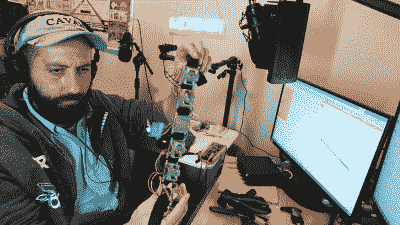

# 前臂肌肉收缩传感器是开源假肢的有用组件

> 原文：<https://hackaday.com/2022/10/20/forearm-muscle-contraction-sensor-is-useful-component-for-open-source-prosthetics/>

能够驱动假肢的一部分可以使它更加有用。为了帮助部分手臂或手截肢者实现这一目标，[turptax]开发了一种用于检测前臂肌肉收缩的传感器[。](https://www.youtube.com/watch?v=tBG6PfTKeKI)

The sensor itself is cost-effective and simple to build.

该建筑是[开放式假肢](https://oprosthetics.org/)项目的一部分，该项目旨在为各种类型的假肢设备提供开放式设计。它模仿普通的商业设计，使用简单的机电系统。

该建筑依靠安装在十二个活塞上的磁铁，当肌肉在皮肤下收缩时，活塞就会移动。活塞装有弹簧，使其能够跟随肌肉的扩张和收缩，磁铁的运动由霍尔效应传感器检测。该系统比其他一些解决方案体积更大，但具有清晰输出的优势，并能够检测几个不同肌肉群的运动。数据全部由 ESP32 收集，然后无线发送到计算机进行测量，[turptax]使用 PyGame 库绘制传感器数据。

[turptax]指出，传感器的输出将完美地输入到机器学习系统中。休息后的视频。

 [https://www.youtube.com/embed/tBG6PfTKeKI?version=3&rel=1&showsearch=0&showinfo=1&iv_load_policy=1&fs=1&hl=en-US&autohide=2&wmode=transparent](https://www.youtube.com/embed/tBG6PfTKeKI?version=3&rel=1&showsearch=0&showinfo=1&iv_load_policy=1&fs=1&hl=en-US&autohide=2&wmode=transparent)

 [https://www.youtube.com/embed/87ypp_IyA28?version=3&rel=1&showsearch=0&showinfo=1&iv_load_policy=1&fs=1&hl=en-US&autohide=2&wmode=transparent](https://www.youtube.com/embed/87ypp_IyA28?version=3&rel=1&showsearch=0&showinfo=1&iv_load_policy=1&fs=1&hl=en-US&autohide=2&wmode=transparent)

