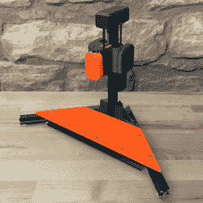

# DIY 热定型嵌入式压机说复杂=舒适

> 原文：<https://hackaday.com/2022/10/23/diy-heat-set-insert-press-says-complicated-comfort/>

热定形嵌件是将机械强度高的螺纹零件嵌入 3D 打印件的绝佳方式。对于安装，所有需要的是一个经济的烙铁；一些我们大多数人已经拥有的东西。

The carriage and counterweight use a v-wheel gantry, GT2 belt, and other common hardware.

对于少量的偶尔插入来说，这很好，但是当大量的插入需要可靠和干净的时候，就需要更精细的东西了。这就是[virchow]的[螺纹镶块冲压设计](https://www.printables.com/model/269233-threaded-insert-press-v1-uc-edition)的用武之地。它将 3D 打印部件添加到铝挤压框架中，以创建一个可以直接上下平稳降低烙铁的压力机，用户只需最少的努力。

烙铁的支架安装在一个小的 v 形轮门架上，该门架沿着垂直的突出部分移动。龙门架的特点是有一个配重，负责重新设定熨斗的位置。[Virchow]承认，这种设计可能被认为是不必要的复杂(因此名字中有“UC”)，但另一方面，没有什么比做一百个左右的插件更能让人体会到每一点舒适和稳定。

热定形嵌件并不难使用，但一点技巧就能帮上大忙。花几分钟时间阅读约书亚·瓦斯奎兹的指南[在 3D 打印零件中使用它们的最佳方式](https://hackaday.com/2019/02/28/threading-3d-printed-parts-how-to-use-heat-set-inserts/)以确保你的零件不仅笔直，而且最终看起来也很棒。