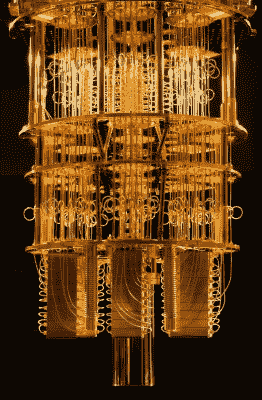

# 万事达卡的新卡:免受量子攻击更安全？

> 原文：<https://hackaday.com/2022/10/25/mastercards-new-card-safer-from-quantum-attacks/>

量子计算机对现代信息技术的许多方面构成了独特的威胁。特别是，如果一个恶意的行为者拥有了一台有能力的量子计算机，许多密码系统都有被破坏的危险。

万事达卡打算在这方面保持领先地位。该公司推出了一种新的非接触式信用卡，据称这种信用卡不会受到某些类型的量子攻击。

## 防黑客？

该卡基于安全支付领域的技术机构 EMVco 的新行业标准。被称为 [EMV 非接触式内核规范](https://www.emvco.com/emv_insights_post/coming-soon-first-emv-contactless-kernel-specification/#:~:text=What%20is%20the%20EMV%20Contactless,seamless%20and%20secure%20contactless%20acceptance.)，它们概述了自动取款机和销售点终端等支付设备处理交易的功能。该规范包括一种新的卡和读卡器之间的“安全通道”通信方法，旨在防止窃听、中继和中间人攻击等常见攻击。新卡旨在与该领域现有的支付硬件兼容。

不过，从密码角度来说，新卡的亮点在于它们的操作方式。传统上，支付卡系统依赖于公钥加密，使用像一直流行的 RSA 算法这样的方法。正如在我们的公钥加密初级读本中所解释的，理论很简单。一个私钥是两个素数，公钥是它们的乘积。用公钥加密信息，只能用私钥中的质数解密。攻击者面临的问题是，即使他们知道公钥，也很难猜出私钥，原因很简单，因为很难找到两个更大的质因数。

[IBM quantum computer](https://www.flickr.com/photos/40748696@N07/40786969122), with 50 qubits. Your credit card is safe, for now.

也就是说，除非你有量子计算机的帮助。拥有足够数量量子位的量子计算机可以运行[肖尔算法](https://en.wikipedia.org/wiki/Shor%27s_algorithm)快速找到非常大数目的质因数。这可用于揭示各种加密算法的私钥。这将破解从世界金融系统到全球政府和公司的加密文件的所有内容。我们目前拥有的一个好处是，还没有足够多纠缠量子比特的量子计算机可以破解我们常用的算法。然而，专家认为这只是时间问题，甚至美国政府也在迅速转向替代的[量子安全加密方法。](https://www.nist.gov/news-events/news/2022/07/nist-announces-first-four-quantum-resistant-cryptographic-algorithms)

因此，万事达卡的新塑料将转向它所说的“抗量子”的新算法，因此不会受到这些攻击。这还将涉及使用更长的密钥长度，以进一步提高加密方法的稳健性。不过，易用性也很重要，因此新系统将认证过程控制在 0.5 秒以内。

有趣的是，EMVco 的文档表明，新卡将包含用于认证目的的椭圆曲线加密(ECC)。传统的 ECC 实际上不被认为是量子安全的。事实上，对于目前普遍使用的密钥长度，ECC 可能比量子计算机的 RSA 更容易破解。

所以这可能只是万事达卡的营销虚张声势。对于世界上最大的支付处理商之一来说，推出已经被认为无法解决上述问题的新技术似乎有些鲁莽。相反，更有可能的是，万事达卡正在使用某种新的 ECC 变体，这种变体对典型的量子计算攻击具有潜在的安全性。各种各样的想法已经在这个领域萌芽，尽管有些想法最近被证明是不安全的。也许他们专注于一些其他算法，但也会支持 ECC。但是如何阻止降级攻击呢？

总的来说，像万事达这样的公司已经在追求量子安全是一件好事。毕竟，推广这样的基础设施需要大量的时间。此外，一旦量子计算机在恶意行为者手中启动并运行，采取行动就太晚了。然而，与此同时，必须严格探索新的加密方法，以确保它们确实能够提供我们需要的安全性。希望新卡已经接受了这样的尽职调查。

标题图片:[ccPix.com](http://www.ccpixs.com/)的“带钱信用卡 Ver3”