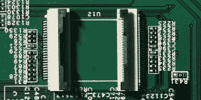

# 用 OpenWrt 闪烁陷阱 Cisco AP，艰难的方式

> 原文：<https://hackaday.com/2022/10/26/flashing-booby-trapped-cisco-ap-with-openwrt-the-hard-way/>

某些制造商非常不喜欢为他们的设备使用开源固件，[这种特殊的黑客攻击](https://sagacioussuricata.com/posts/meraki-mr33/)采取了非常极端的反业余爱好者措施。思科制造的 Meraki MR33 在硬件方面是一个很好的接入点，[在它上面运行 OpenWrt](https://openwrt.org/toh/meraki/mr33)非常棒——如果不是思科的[恶意决定](https://github.com/riptidewave93/LEDE-MR33/issues/13#issuecomment-449849255)一旦你通过串口进入 Uboot 就永久阻塞 CPU 的话。这个 AP 似乎是“硬件即服务”产品的一部分，在 OpenWrt 端口发布后的一段时间，OTA 更新推出了陷阱 Uboot。

有一个更老的 Uboot 版本可用，但你不能完全回滚到它，直到某一点，维基上只有一个 JTAG 降级路径——其完整描述由“FIXME: describe the process”标签组成。我们的黑客，一个来自[sagaciditsuricata]博客的匿名用户，决定走一条不同的路——提升、转储和修改板载闪存，以降低引导加载程序的级别，并指导我们完成整个过程。关于这个黑客有相当多值得注意的事情，比如使用 Nix package manager 在一个长期放弃 Python 2.7 的操作系统上获得 Python 2.7，以及关于一个可行的轻量级 TFTP 服务器的提示，但闪存芯片部分吸引了我们的眼球。

flash 芯片采用 TSOP48 封装，使用并行接口和 iMX6。LL devboard 用于读取、修改和闪回映像——热插拔芯片，就像我们过去对旧的并行接口 BIOS 芯片所做的那样。我们特别喜欢使用 FFC 电缆和连接器，以允许热插拔的方式将闪存芯片连接到 devboard 现在我们可以看到，TSOP 0.5 毫米间距和 0.5 毫米 FFC 硬件是天作之合。当然，这种技术将适用于许多配备 TSOP48 的设备，如果你身边没有程序员，最好有一个工具包。

最终，美联社获得了新生，现在由它的所有者管理，而不是思科的突发奇想。对于任何面临配备并行闪存设备的人来说，这是一个方便的教程，唯一的方法似乎是艰难的方法，我们很高兴看到黑客们[越来越适应](https://hackaday.com/2019/12/06/swapping-the-roms-in-mini-arcade-cabinets/)面对这样的挑战，无论是[并行闪存](https://hackaday.com/2012/09/20/reading-bare-nand-flash-chips-with-a-microcontroller/)、 [JTAG](https://hackaday.com/2020/02/24/the-newbies-guide-to-jtag/) 还是[电源故障。](https://hackaday.com/2016/10/04/glitching-usb-firmware-for-fun/)毕竟，当你的设备可以完全在你的控制下运行操作系统是一件好事——从历史上看，你[通过这种方式获得更多的功能，](https://hackaday.com/2012/01/19/complete-guide-to-compiling-openwrt/)但制造商也不能像亚马逊(Amazon)的 Fire TV 盒子那样[拖你的后腿。](https://hackaday.com/2014/12/07/amazon-fire-tv-update-bricks-hacked-devices/)

我们感谢[WifiCable]与我们分享这些！

(编辑注:将“OpenWrt”的实例改为“OpenWRT”。)