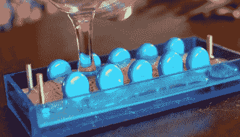

# 等离子频道展示了一个非常时尚的 Fusor

> 原文：<https://hackaday.com/2022/10/27/plasma-channel-shows-off-a-remarkably-stylish-fusor/>

多年来，我们已经看到了法恩斯沃思-赫希 fusors 的公平份额，这些高压设备可以让离子烹饪到实现核聚变的程度，即使是在业余爱好者的预算内，尽管它们不会解决世界能源问题，但它们肯定会成为一场令人印象深刻的灯光秀。虽然相对来说建造起来“简单”,但我们过去看到的例子仍然是由装满适合核反应堆的复杂设备的手推车支撑的笨重装置。

这就是为什么最近完成的 fusor [Jay Bowles]如此令人印象深刻的原因。正如你在最新的*等离子频道*视频中看到的，我们把它放在了休息时间的下方，这个桌面“罐子里的星星”不仅部件数量少得令人难以置信，而且看起来更像是一个电影道具，而不是你在物理实验室里可能会看到的任何东西。如果你曾经考虑过建造一个自己的 fusor，但是被现有设计的大小和复杂性所阻碍，你一定会想看看这个。

Epoxy protects the HV components, plus it looks cool.

这件作品看起来一点也不花哨，这至少可以部分归功于[Jay]众所周知的对用多色丙烯酸板建造东西的热爱。但你也必须赞扬真空室的透明壁，它提供了电极周围等离子体场的惊人景象。在传统的 fusor 中，你通常会在结实的金属箱侧面看到一个小视窗，但在这种情况下，它几乎是反过来的。

现在要明确的是，这个版本并不是没有问题。鉴于[Jay] [已经习惯了这类项目](https://hackaday.com/2021/11/12/exploring-the-healing-power-of-cold-plasma/)，建造 40 千伏环氧树脂封装的电压倍增器对他来说不成问题，但这是他第一次尝试在真空中工作。正如你所料，这意味着从如何密封连接到用来拉下真空室的泵的强度，围绕着一切都要进行一些反复试验。尽管如此，在几次失败的开始后，他接受了封闭等离子体的迷人治疗。

[Jay]说下一步是将一些氘引入反应室，请继续关注最新进展。就像他上个月组装的多级离子推进器一样，我们希望随着改进的进行，这个项目会定期在 T2 等离子频道上出现。当[Jay]登上[2022 hack aday super conc](https://hackaday.com/2022/10/11/2022-supercon-more-talks-more-speakers/)的舞台时，我们也很有可能会听到更多关于这些建筑的消息。

 [https://www.youtube.com/embed/VTBZ0VwIgs8?version=3&rel=1&showsearch=0&showinfo=1&iv_load_policy=1&fs=1&hl=en-US&autohide=2&wmode=transparent](https://www.youtube.com/embed/VTBZ0VwIgs8?version=3&rel=1&showsearch=0&showinfo=1&iv_load_policy=1&fs=1&hl=en-US&autohide=2&wmode=transparent)

