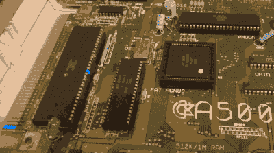

# 现在你可以用这个奇怪的技巧不用软盘引导你的 Amiga 了

> 原文：<https://hackaday.com/2022/10/28/you-can-now-bootstrap-your-amiga-without-a-floppy-with-this-one-weird-trick/>

传统上，大多数 Amigas 都是从软盘启动的。。Amiga 可以很容易地制作自己的引导软盘，但只有当它已经启动。如果你还没有准备好软盘，那你就不走运了，因为个人电脑不能轻易为 Amigas 制作软盘。[[Roc]发明了 amigaXfer 引导方法来解决这个问题。](https://www.rvalles.net/bootstrapping-an-amiga-without-a-bootable-amiga-floppy.html)

Shorting a couple of pins together can unlock a serial debug mode that can be used for bootstrapping the machine.

[可从 Github](https://github.com/rvalles/pyamigadebug/releases/) 上获得，amigaXfer 工具能够通过其串行端口使用 Amiga 执行多项任务。当通过串行连接插入另一台运行 amigaXfer 的计算机时，必须首先打开 Amiga。当工作台软盘提示出现时，amigaXfer 上的 CrashEntry 功能应该被触发，Amiga 的 68000 CPU 上的 BERR 和 GND 引脚应该只连接一瞬间，触发 Amiga 进入特殊的串行调试模式。这使得 amigaXfer 能够取得控制权，允许格式化磁盘并写入调试引导块，然后可以使用该磁盘引导 Amiga，而无需黑客攻击。

如果你刚刚从易贝买了一台 Amiga，而且没有附带任何磁盘，这是一个让它正常运行的好方法。从这里，您也可以使用 amigaXfer 通过用于引导过程的同一条串行电缆将其他程序加载到 Amiga 上。黑客攻击也不仅限于 Amiga 500。它应该可以在一系列机器上运行，包括 AmigaOS 版本 1.x、2.x 和 3.x。

不像[准将 64，](https://hackaday.com/2019/03/12/its-raining-brand-new-commodore-64s/)我们可能不会很快看到[全新的复制品阿米加斯](https://hackaday.com/2020/06/16/why-you-probably-wont-be-building-a-replica-amiga-anytime-soon/)，但是我们可以做梦。和往常一样，如果你有，把你最热门的 Amiga 项目[发送到 tipsline！](http://hackaday.com/submit-a-tip)