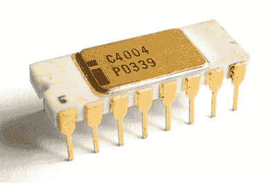
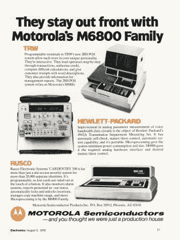
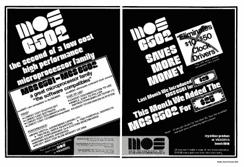

# 问问 Hackaday:说到处理器，你能追溯到多远？

> 原文：<https://hackaday.com/2022/12/01/ask-hackaday-when-it-comes-to-processors-how-far-back-can-you-go/>

当最近宣布 Linux 内核可能会放弃对英特尔 486 系列芯片的支持时，[我们看了一下 486 世界的状态](https://hackaday.com/2022/11/02/bye-bye-linux-on-the-486-will-we-miss-you/)。你再也不能从英特尔买到它们了，但你可以买到克隆产品，这显然仍在嵌入式设备中使用。但这让我们想到:如果买不到正版 486，还有哪些老 CPU 还在生产，哪个最老？

## 定义一些规则

The daddy of them all, 1972’s Intel 4004 went out of production in 1981\. Thomas Nguyen, [CC BY-SA 4.0](https://commons.wikimedia.org/wiki/File:Intel_C4004_b.jpg)

有几个明显的竞争者立即浮现在脑海中，例如 1975 年的 6502 和 1976 年的 Z80 仍然随处可见。其他一些旧硅以核心的形式存在于其他芯片中，例如古老的英特尔 8051 微控制器可能在几年前就已经摆脱了这个 40 引脚 DIP 的凡人线圈，但今天却愉快地管理着许多现代设备的活动。此外，还有一个迷人的专业过时零件制造世界，可以专门为极其富有的客户生产一批无法获得的硅。例如，如果山姆大叔需要一箱 1974 年的英特尔 8080，罗切斯特电子公司可以满足他的需求。

因此，当我们寻找最古老的 CPU 时，我们谈论的是常规生产中可用的 CPU，而不是旧库存，不是特殊制造，也不是现代部件中包含的核心。今天生产的最老的 CPU 是哪一种，当年的工程师能认出来？要回答这个问题，有必要追溯早期微处理器的时间表，梳理全球电子供应商，寻找不知名的芯片。

## 工作了这么多年

A Motorola M6800 advert from 1976\. The architecture survives in some of NXPs microcontroller ranges. Motorola, [Public domain](https://commons.wikimedia.org/wiki/File:Motorola_MC6800_microprocessor_ad_August_1976.jpg).

第一批微处理器出现在 1972 年的市场上，Intel 的 4004 被普遍认为是该品种的第一款。今天，早期的英特尔芯片都没有正式生产，我们怀疑主要是因为前面提到的 Z80 的成功。它与 8080 指令的向后兼容性以及比 Intel 部件更少的支持芯片数使它成为一个巨大的销售者，并且是在该领域继续发展的明显选择。据我们所知，在最初的几年里，没有其他人幸存下来。这不应该太令人惊讶，因为微处理器是一种新的、昂贵的、快速发展的技术，没有一种芯片获得足够的市场份额来获得长寿。

因此，由于 72 年和 73 年的作品都已停产，1974 年的事情变得有趣起来。TMS1000 掩模编程微控制器早已消失，但摩托罗拉 6800 系列仍以瑞萨制造的日立 HD46800 及其衍生产品的形式出现在供应商清单中。近距离观察显示，这些处理器是由罗切斯特电子公司提供的，但遗憾的是，我们没有找到我们最早的仍在生产的芯片。[恩智浦 HC05 和 HC08 微控制器](https://www.nxp.com/products/processors-and-microcontrollers/legacy-mpu-mcus/8-bit-legacy-mcus:8-BIT-LEGACY-MCUS)可能是 6800 的远祖，但这里不算，因为它们不是同一个部件。

就像一个疲惫的魅力摇滚乐队看不到地平线上的朋克，我们跌跌撞撞地来到了 1975 年。这里有一个明显的竞争者，就是前面提到的 6502。它在同年 9 月的 Wescon 电子贸易展上首次出售，并继续以 CMOS 形式提供 WDC 65 C02 T1。在加冕之前，还有一个竞争者。RCA 1802 是在 1975 年或 1976 年推出的，在一些供应商网站上被列为 Harris CDP1802。然而，据我们所知，它是在 1976 年初首次销售，但它再次被披露是通过罗切斯特电子公司。

## 获胜者和其他几个人

Winning since 1975, the 6502! MOS Technology, [Public domain](https://commons.wikimedia.org/wiki/File:MOS_6501_6502_Ad_Sept_1975.jpg).

我们有一个赢家，在 6502。它在家用电脑中的受欢迎程度和在无数控制系统中的普通外观使它在生产中保持了近 50 年，其影响已经渗透到很远很广的地方。

但是在我们结束这个话题之前，有必要看一看其他一些著名的微处理器家族，看看他们的祖先是否还存在于 70 年代后期。

公平地说，我们已经涵盖的系列跨越了 20 世纪 70 年代中期以来大多数流行的 8 位线，到了 10 年末，前沿的注意力已经转移到 16 位设计上。其中，1979 年的摩托罗拉 68000 在 20 世纪 90 年代中期停产，剩下的最接近的家族部件是[恩智浦的 Coldfire 系列](https://www.nxp.com/products/processors-and-microcontrollers/legacy-mpu-mcus/32-bit-coldfire-mcus-mpus:PC68KCF)。对于它的 8086 竞争对手，我们已经在上面讨论了更晚的 486，但令人惊讶的是，有一家半导体公司仍然在其产品线中列出相当于 16 位英特尔部分的 an。[乌克兰基辅的克瓦扎尔工厂](https://www-kwazar--is-kiev-ua.translate.goog/nomen.htm?_x_tr_sl=auto&_x_tr_tl=en&_x_tr_hl=en&_x_tr_pto=wapp&_x_tr_sch=http)(谷歌翻译链接)拥有 KR1810VM86 苏联 8086 克隆体，尽管遗憾的是由于乌克兰的战争，我们猜测他们此刻可能有更重要的事情要做。

最后，PIC 微控制器的一些用户可能会惊讶地发现，这个系列的根源在于一个早已被遗忘的通用仪器 16 位系统的外围芯片。1976 年的 PIC1650 只是一个包含可编程内核的外设接口控制器。这使它的用途远远超出了最初的应用，虽然最初的芯片早已停产，但仍有 PIC 芯片在生产，它们共享最初的 PIC 架构。

当我们在 Hackaday 员工中讨论这个话题时，我们并不指望 6502 会成为赢家，因为我们确信其他一些人会成功。但由于我们的规则集适用于批量生产的设备和原始芯片，而不仅仅是架构，所以如此受欢迎的东西仍在生产就不足为奇了。让我们希望它在进入第六个十年后仍在销售！

头图:保利·劳塔科尔皮， [CC 乘 3.0](https://commons.wikimedia.org/wiki/File:MOS_6502_die.jpg) 。