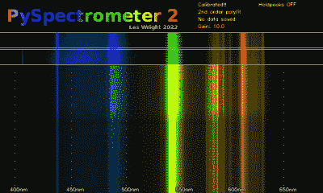

# 基于 Pi 的光谱仪得到升级

> 原文：<https://hackaday.com/2022/10/29/pi-based-spectrometer-gets-an-upgrade/>

在 Hackaday，我们喜欢看到项目在我们的网站上发布后被重新访问和更新。看到创造者下一步想出什么总是令人兴奋的，这个基于 Pi 的光谱仪项目就是一个很好的例子。

[LesWright]在新版 Raspberry Pi 操作系统发布时(牛眼)发现自己遇到了一个问题，它破坏了他原来软件上的一些功能。[Les]没有仅仅解决问题，而是选择更大幅度地重写软件,最终得到了一台更强大的光谱仪，能够与价格高出数倍的专业设备相匹配。

Screenshot of Waterfall Display for PySpectrometer 2

通过使用多波长校准和多项式回归数据，新版本更加精确，现在可以分辨出+/-1 纳米的波长。

整个项目现在用 OpenCV 编写，有一个漂亮的新瀑布光谱显示，它将显示测量光谱随时间的变化。

低成本台式分光镜通过 CCTV 变焦镜头耦合到 RaspberryPi 摄像机，整个设置安装在一个小铝块上，以实现热和机械稳定性。分光镜指向荧光灯，用户被引导通过校准程序来调整软件到硬件。

我们对[Les]用他的构建所达到的精确度印象深刻，并且报道足够详细以允许其他人跟随他的脚步。我们很想知道读者是否会自己建立一个，以及他们用它们做什么！

如果你想了解最初的版本，你可以在这里找到我们的文章。我们过去报道过几个光谱项目，包括这台[伽马射线光谱仪](https://hackaday.com/2022/05/03/identify-radioactive-samples-with-this-diy-gamma-ray-spectrometer/)和[这台基于 STM32 核子](https://hackaday.com/2022/02/19/spectrometer-detects-chemicals-by-zapping-samples-with-a-laser-beam/)板的光谱仪。

 [https://www.youtube.com/embed/SCp9T8NKfnM?version=3&rel=1&showsearch=0&showinfo=1&iv_load_policy=1&fs=1&hl=en-US&autohide=2&wmode=transparent](https://www.youtube.com/embed/SCp9T8NKfnM?version=3&rel=1&showsearch=0&showinfo=1&iv_load_policy=1&fs=1&hl=en-US&autohide=2&wmode=transparent)

