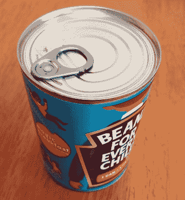

# 你所有的像素都属于(可能不属于)Pantone

> 原文：<https://hackaday.com/2022/10/29/all-your-pixels-are-probably-not-belong-to-pantone/>

目前有一条消息在开放知识产权和相关社区传播，这似乎引起了一些恐慌。它来自 Adobe，Adobe 宣布，由于与 Pantone LLC 的许可协议终止，[载入 Photoshop 的 PSD 图像将包含未经许可的 Pantone 颜色的像素替换为黑色](https://helpx.adobe.com/photoshop/kb/pantone-color-books-photoshop.html)。什么，潘通现在有颜色了？难道我们每次拍一张蓝天的照片都要支付版税吗？当听到这样的消息时，很自然会有怀疑的反应，但这一次我们认为这可能不是它可能首先出现的不合理的知识产权土地掠夺。为了说明这一点，有必要解释一下 Pantone 做什么，他们不做什么。

[Heinz use Pantone](https://www.pantone.jp/pages/pantone.aspx?pg=20982) to ensure their [Viridian Green](https://www.pantone.com/connect/17-5126-TPX) baked bean branding colour is consistent. Use it on a can of beans and Heinz will probably sue you, not Pantone.

对于一家将整个产品线建立在颜色基础上的公司来说，说 Pantone 不拥有或销售颜色可能会显得很奇怪。相反，他们的产品实际上是一种配色服务，一个定义和命名的颜色库，可以由设计师、印刷商、油墨制造商、涂料公司以及任何生产彩色产品的人进行配色。他们所拥有的是库中一种颜色的名称和索引号，而不是颜色本身。如果设计师为客户设计徽标并为其指定 Pantone 颜色，客户就会知道他们可以从 Pantone 许可的油漆公司订购完全相同颜色的卡车油漆，或者让印刷商使用 Pantone 许可的油墨印刷完全相同颜色的包装。品牌的一致性对公司来说很重要，潘通卖的是一致性，而不是颜色本身。顾客可以自由搭配任何墨水或涂料的颜色，但是他们很快就会发现，精确的颜色搭配并不是一件容易的事情。潘通的业务在于消除这种头痛。

因此，对于 Pantone 来说，如果一幅图像恰好包含大量与他们库中的颜色相匹配的像素，那么它就很难辩称侵犯了他们的知识产权，因此你的图片不会被他们窃取。一些 Photoshop PSDs 现在面临这个问题的原因是，Photoshop 允许设计师将 Pantone 索引附加到一种颜色上，对于应用了这种索引的文件，Adobe 表示他们不再拥有对此采取行动的许可证。问为什么在 2022 年，一个基于有缺陷的每月订阅模式的专有图像处理包仍然对设计师有如此大的影响力，这完全是一个潘多拉盒子，但就 Hackaday 的读者而言，没有什么可担心的。没人会来救我们的宝贝！

表头图片:Tuxyso ( [CC BY-SA 3.0](https://commons.wikimedia.org/wiki/File:Ara-Zoo-Muenster-2013.jpg) )。