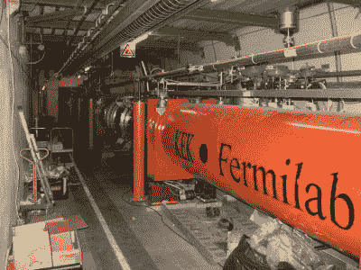
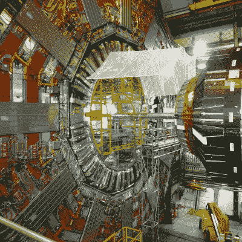

# 欧洲能源短缺迫使大型强子对撞机停止运行

> 原文：<https://hackaday.com/2022/10/31/europes-energy-squeeze-pushes-large-hadron-collider-to-halt-operations/>

最近，能源价格经常出现在新闻中，战争也是如此。这两者通常是相辅相成的，因为冲突往往会影响化石燃料的供应和贸易。

随着欧洲天然气短缺，其公民正在考虑一个寒冷的冬天，科学也感到了压力。欧洲粒子物理研究所已经决定提前关闭大型强子对撞机以节省电能。

# 账单休克

随着欧洲今冬面临严峻形势，欧洲核子研究中心已同意法国电力公司(EDF)的请求，未来将削减其用电量。该实验室将在 2022 年剩余时间和 2023 年削减能源消耗，以帮助减轻法国电网的负荷。

CERN 理事会于 9 月 26 日批准了该计划。2022 年，欧洲核子研究中心将提前两周关闭其运作，以帮助减少需求，并于 11 月 28 日宣布技术停止。它还将在 2023 年将运营规模缩减 20%。这将主要通过明年初关闭四周，在 11 月中旬的某个时候停止运营来实现。CERN 的运行开始日期在 2023 年和 2024 年将保持不变，实验室将按照计划在 2 月下旬再次开始主要工作。

Much of the LHC’s energy use is required to keep the facility’s superconducting magnets cool. Credit: [gamsiz, CC-BY-2.0](https://en.wikipedia.org/wiki/File:LHC_quadrupole_magnets.jpg#/media/File:LHC_quadrupole_magnets.jpg)

作为一个高能物理实验室，欧洲粒子物理研究所即使在正常年份也会积累大量的能源费用。最大的份额来自该组织的皇冠上的明珠，大型强子对撞机(LHC)，并冷却粒子加速器的超导磁体，其工作温度为-271 摄氏度。为了保持这一温度，LHC 依赖于 27 兆瓦的液氦冷却系统。事实证明，做高能物理对能量的要求很高。欧洲核子研究中心在用电高峰期消耗大约 200 兆瓦，但在较平静的冬季月份，这个数字下降到只有 80 兆瓦。

在正常运行的典型年份，CERN 使用大约 1.3 太瓦时的电力。相比之下，日内瓦市有 20 万人口，每年消耗 3 太瓦时。其 2022 年的电费估计在 8900 万美元左右。

减少活跃的研究时间将有助于节约能源。然而，由于维护要求，减少 20%的运行时间不会导致 20%的能耗下降。例如，LHC 的超导磁体即使不使用也必须保持冷却。

欧洲核子研究中心不仅仅是削减科学经费来减少能源消耗。它也将采取常规措施。在实验室的校园里，夜间街道照明将尽可能关闭，每年供暖的时间将减少一周。

[LHC CMS Detector](https://www.flickr.com/photos/13685498@N00/14972545150) by Luigi Selmi

据欧洲核子研究中心称，缩减运营的决定主要不是因为能源成本不断攀升。相反，采取措施是出于对更广泛社会的关注。欧洲大部分地区依赖天然气取暖和发电。随着俄罗斯继续对乌克兰发动战争，这些供应十分稀缺。对即将到来的冬天、轮流停电和潜在供应短缺的担忧比比皆是。因此，目标是确保有足够的燃料资源来满足人们家庭重要的供暖和电力需求。

提前关闭意味着一些实验将不再按计划进行。那些打算在运行的最后两周使用 CERN 设施的科学家将被重新安排到 2023 年。这也意味着，除了进一步缩减的 2023 年计划的影响之外，明年对设施的时间竞争将更加激烈。

其他科学机构也感受到了压力，其中一些比欧洲核子研究中心对成本更加敏感。德国电子同步加速器有提前几年支付部分能源账单的合同，以避免峰值。虽然 2023 年同步加速器的 80%的费用已经覆盖，但最后的 20%仍悬而未决。按照目前的价格，本组织目前无力支付这笔费用。管理层正在寻求额外的政府资助，并探索以较低的功耗设置运行其部分硬件，作为一种妥协。

欧洲核子研究中心的大部分工作是高概念物理学，对我们今天的生活没有巨大影响。然而，那里所做的研究是最尖端的，对人类有深远的价值。不过，就目前而言，随着欧洲面临一个寒冷而不确定的冬天，缩减业务是明智而高尚的做法。