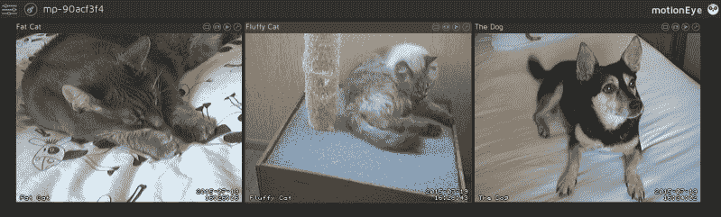
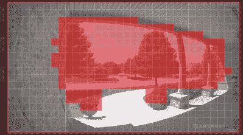
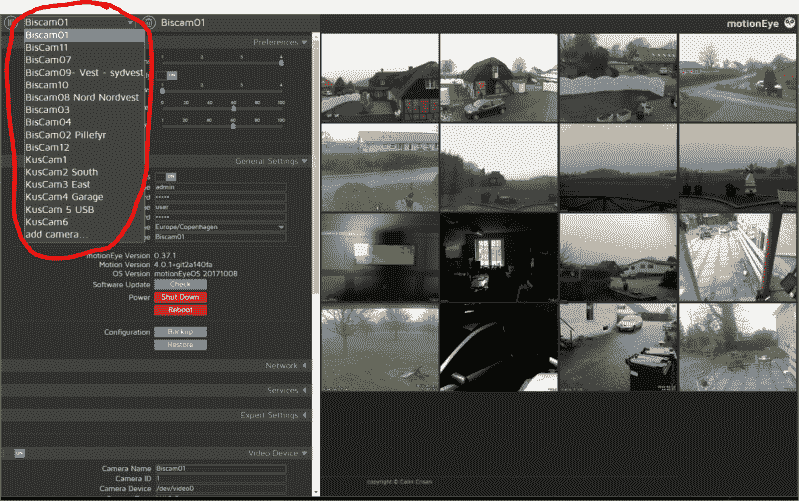

# 让你的私家侦探兼做安全摄像头

> 原文：<https://hackaday.com/2022/11/02/make-your-pi-moonlight-as-a-security-camera/>

十年前，我通过构建自己需要的项目来学习 Linux。其中一个项目是一个基于 Linux 盒子的 DIY 闭路电视系统——具体来说，是一个用户友好的一体化软件包，供愿意付费的人使用。我偶然发现了 Zoneminder，那些知道内情的人已经知道发生了什么——我这么说吧，我花了几天时间试图让它工作，当时我的 Linux 技能还远远不够。像 Motion 这样的酷软件在当时是可以使用的，但是我还不能胜任围绕它运行整个系统的任务。也就是说，这不是不可能的，不是吗？

五年后，我加入了一个黑客空间，并最终发现它的闭路电视摄像头虽然在视觉上非常突出，但很久以前就停止工作了。在那个时候，我有能力做些什么，我围绕一个叫做 [MotionEye](https://github.com/motioneye-project/motioneye/) 的软件包建立了一个完整的闭路电视网络。在黑客空间使用闭路电视摄像头有很多价值——一个正常运行的系统不仅解决了“谁制造了没人承认的混乱”的问题，多年来它还帮助我们找到了激光切割机的安全联锁键，这些安全联锁键在重组期间被移除，它们的临时位置很快被遗忘。

能够使用 MotionEye 快速创建安全摄像头很快就变得非常方便——当我需要时，我可以制作一个简单的摄像头来监控我的自行车，验证我的邻居没有忘记在我离开时按照承诺喂我的宠物，在某种情况下，我甚至可以在它的帮助下确保我和其他人的人身安全。你如何在你的房子、黑客空间或其他地方建立一个有用的始终记录的摄像机网络？今天我想向大家展示一个简单而强大的软件包，它叫做 MotionEye。

## 帮助= >关于

Motion 是一个强大的守护程序，用于以类似安全摄像机的方式处理 Linux 上的视频流——它可以检测运动并在运动发生时记录视频剪辑。然而，它是一个命令行守护程序，它没有一个足够舒适的图形界面来进行用户友好的相机图像工作。MotionEye 是一个 Python 包，它包装了 Motion，为您提供了一个管理相机的 web 界面，但更重要的是，它是生活质量功能的宝库。

MotionEye[安装](https://github.com/motioneye-project/motioneye/wiki/Installation)相当容易——它只需要你的操作系统上的几个包和一些 Python 依赖项，你可以使用 systemd 之类的东西将它设置为自动启动。然后，将你的浏览器指向它的网络界面，你就会看到 MotionEye 提供的所有功能，可以通过桌面操作系统和手机访问。如果你喜欢你的软件，还有 [Docker 图片](https://github.com/motioneye-project/motioneye/issues/2601#issuecomment-1256923747)！从那里，您可以开始探索特性。

例如，在使用无图形用户界面工具时，移动侦测的设置可能会很麻烦——有时您的图片中会有一些区域一直在变化，但您并不认为这些区域对移动侦测有意义。MotionEye 允许您通过 web 界面快速设置运动遮罩，然后运动守护程序使用它在运动事件的源头过滤运动事件，同时尽可能减少开销。它还为您提供了硬件编码等选项，否则您可能会在手册中忽略这些选项。

对于我们这些不想建立某种本地存储，或者只想将移动通知推送到手机上的人来说，MotionEye 可以使用无数依赖于在线服务的图片和视频上传方式——电子邮件、Google Drive、Dropbox 等等。它还允许您在运动事件开始和结束时设置命令行挂钩，然后您可以将这些挂钩用于各种自动化任务——我个人曾使用这些挂钩使用`matplotlib`来绘制运动事件，作为一种可视化 hackerspace 出勤数据以实现自动化的方法。

当然，也有局限性。例如，就像它所基于的 Motion 一样，MotionEye 没有音频支持——尽管你可以使用 MotionEye 钩子和外部音频录制脚本来将声音拼接到录制的剪辑中。如果你有不同长宽比的相机，MotionEye 不会总是在一个整洁的网格中显示它们，尽管我过去已经通过 CSS 黑客解决了这个问题。然而，就您所能做的而言，它仍然是一个强大的软件包。

## MotionEyeOS–开箱即用的体验

你也不需要预先安装发行版。MotionEyeOS 是一个小的 SD 卡镜像，带有 MotionEye 和使其运行所需的一切，在 Buildroot 的帮助下构建。只需将图像闪存到 MicroSD 卡，提供无线凭证或插入以太网电缆。设置 MotionEyeOS 后，它会自动拾取它找到的所有摄像头，包括 CSI 连接的 Raspberry Pi 摄像头(如果找到的话)。需要澄清的是，它不仅限于树莓 Pi——还有针对 Odroid、NanoPi、BananaPi、OrangePi 和 Pine46 板的[版本](https://github.com/motioneye-project/motioneyeos/releases)。

MotionEyeOS 在默认情况下为系统使用只读存储，我发现它对断电有着难以置信的恢复能力，当然，如果你不启用本地记录，除了对 SD 卡的设置更改之外，它不会写任何东西。由于图像很小，我用了一些剩余的 512MB 卡作为我搭建的主板。对于单一用途的相机来说，它是如此方便，也许它唯一的问题是尚未为 Zero W 2 这样的板更新，但 MotionEye 社区成员有定制版本！

在默认配置中，MotionEye 将记录到您的可用主存储设备上——在独立安装 MotionEye 的情况下，使用您的根文件系统；在安装 MotionEyeOS 的情况下，这将是一个自动创建的分区，占用所有未被 MotionEyeOS 内核占用的空间。鉴于你可能会通过插入 Raspberry Pi 的 SD 卡来运行它，如果你连接 USB 硬盘或固态硬盘会更有意义，如果你设置了多个摄像头，网络连接的存储设备会更好。这就引出了下一点！

## DVR 也准备好了

MotionEye 不仅适用于配备摄像头的设备，你还可以用它来制作 DVR。为此，在一台功能相当强大的电脑上安装 MotionEye，配备几个大容量廉价硬盘，然后让它从网络摄像机中抓取视频，无论是基于 MotionEye 的摄像机还是连接到无互联网子网的中国 IP 摄像机。有了这样的设置，你就不必在相机本身上进行运动检测或存储——这让你可以使用廉价的 Raspberry Pi 板，甚至像最初的 Model B 一样，以及小型 SD 卡，而不必担心在写入中途断电时视频文件损坏。

在前面提到的 hackerspace 中，我在各个角落放置了一堆与 Raspberry Pi 相连的摄像头，有些由 MotionEyeOS 驱动，有些则添加了 MotionEye，以及已经在其上运行的软件，以实现各种 hackerspace 功能。我们的 DVR 平台是一个工业 DN2800MT 主板，上面有和两个软件 RAID1 中的 SATA 硬盘-我没有硬件编码，因为 N2800 的 iGPU 驱动程序在 Linux 上不够好，但 CPU 足以同时处理 8 个不同分辨率的摄像头。

你也不必使用单独的 DVR。您可以拥有 MotionEye 摄像机，然后在某台计算机上，甚至是您的个人笔记本电脑上，将 MotionEye 设置为非录制摄像机查看器，这样您就可以从一个位置查看和配置所有摄像机。通过这种方式，您可以获得一个包含所有摄像头的仪表板，并且不需要额外的硬件。你会发现 MotionEye 比我告诉你的场景更灵活，但这是你可以做的事情的一个很好的概述。

## 伸出援手，保持安全，保持装备

现在，MotionEye 是许多人珍视的项目之一，但目前没有得到足够的开发者关注，因为主要开发者已经在两年前辞职了。由于它所提供的价值，社区仍然是活跃的和有帮助的，但是代码库可以使用一些愿意钻研它的人。代码非常容易维护，但有无数的 TODOs 要处理——我注意到只有少数几个正在解决 Python 3 端口的问题，将新的 Raspberry Pi 固件集成到构建中，修改 Buildroot 集成，修复 Google Drive 集成，并处理所有累积的小问题。

您可能已经有了一个使用案例，但是不要忘记查看您当地的法律！你可能不被允许随心所欲地使用相机，或者在相机的视野范围内使用某些东西。然而，对于你所在的地方来说，贴上“正在录像”的标签就足够了。人们也可以争辩说，如果摄像机在你的财产上，它有权在那里并执行摄像机所做的所有功能。另一方面，客人被你客厅里的摄像头吓到也没什么错——因此，要做出相应的调整。

你可能有一两个备用的 Raspberry Pi 相机，现在你知道你可以用它做什么了。谁知道你能造出什么呢——毕竟，我们甚至见过由 MotionEye 驱动的[万圣节装饰品！](https://hackaday.com/2020/11/03/raspberry-raven-pi-security-camera-does-double-duty/)下一次，我将告诉您更多关于保护 Linux 驱动的摄像头网络的信息，特别是在您的局域网上使用点对点 Wireguard 隧道——确保即使您的 WiFi 连接摄像头也无法被窥探。