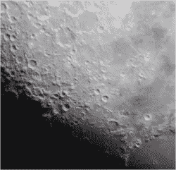

# 3D 打印牛顿望远镜有惊人的外观，哈德利打破了银行

> 原文：<https://hackaday.com/2022/11/04/3d-printed-newtonian-telescope-has-stunning-looks-hadley-breaks-the-bank/>

有没有考虑过自己造望远镜？这样的项目可能会令人望而生畏，尤其是如果你自己磨镜子的话。但是有了 3D 打印机、五金店的零件和一些便宜的预制镜子，你也可以自豪地拥有自己的[哈德利——一架 900 毫米的牛顿望远镜](https://www.printables.com/model/224383-astronomical-telescope-hadley-an-easy-assembly-hig)，建造成本不到 150 美元！查看休息时间下方的视频，了解该项目的详细情况。

Astrophotography is possible with the Hadley

创造者声明的目标是“*为 100-200 美元范围内的劣质、难以使用的“业余爱好杀手”瞄准镜制造一个有吸引力的替代品*，我们不得不说，它似乎令人钦佩地达到了目标。光学元件是任何建筑中最复杂的部分，可以很容易地在网上购买，其余部分可以在当地的五金店买到。

虽然最初的版本是以英制为单位，但现在有了公制版本。不同的贡献者创造了一个丰富的生态系统，包括[配件和各种部件的替代版本](https://www.printables.com/model/224383-astronomical-telescope-hadley-an-easy-assembly-hig/remixes)，所有这些都是为了让望远镜更有用。像三脚架、手机支架(用于你最喜欢的星图应用程序)等东西只需点击一下。唯一需要回答的真正问题是“我将使用什么颜色的灯丝？”

当然，有时光波可能会变得有点长，在这种情况下，你会需要一个射电望远镜，这也可以通过卫星天线和 SDR 软件狗来实现！

 [https://www.youtube.com/embed/jCWE1QRoIzU?version=3&rel=1&showsearch=0&showinfo=1&iv_load_policy=1&fs=1&hl=en-US&autohide=2&wmode=transparent](https://www.youtube.com/embed/jCWE1QRoIzU?version=3&rel=1&showsearch=0&showinfo=1&iv_load_policy=1&fs=1&hl=en-US&autohide=2&wmode=transparent)

