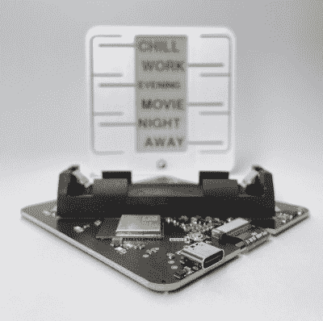

# 用 Home 键触发你的家庭自动化程序

> 原文：<https://hackaday.com/2022/11/10/trigger-your-home-automation-routines-with-home-buttons/>

家庭自动化系统都很好，只要建造它的人在旁边驾驶它。让我们面对它，它们通常是一个复杂的互联系统网络，都与一个人的家庭细节相关联——如果在寒冷的日子里，锅炉的接口是通过 Python 脚本，而某些东西无法工作，那么不太熟悉它的人可能会有点恼火。随便说说。[hack aday 上的[Matej planin ek]主页按钮。IO](https://hackaday.io/project/188075-home-buttons) 是一个非常好的项目，它旨在通过为这些自动化例程提供一个圆滑的前端，使任何人都可以轻松地启动一个自动化例程，从而消除自动化中的一些杂乱。

PCB 基于 ESP32-S2-mini，使用通常的 MQTT 协议处理 WiFi 连接和与家庭助理的集成。我们希望与其他类型的家庭自动化集成并不难实现。该单位的中心举行了一个简单的 E-Ink 显示器，为低待机功率。具体来说，选择的单元是一个很好的显示器 GDEY029T94 2.9”，这位抄写员可以确认它很容易接口，并且从通常的中国在线供应商那里购买非常便宜。这与六个 clicky Alps SKRB 系列薄型轻触开关相匹配，这些开关位于显示器的两侧，对应于 3D 打印前壳上的弯曲型事件。简洁明了。

PCB 设计以 Altium 格式提供，你可以在项目 GitHub 页面上[找到。这展示了一个简单的设计，到处都有一些不错的小细节。据报道，内部安装的 18650 电池至少可以工作一年，但当时间到了，它可以通过 USB 充电。一个](https://github.com/nplan/HomeButtons) [Xysemi XB8608AF](http://www.horchips.com/data/uploads/2019/09/28/255155d8f19e9c0675.pdf) (PDF)保护芯片为 18650 电池提供了适当的限制，保护它免受过度充电、放电等危险。在目前的情况下，这不太可能。一个 [Sensiron SHTC3](https://sensirion.com/products/catalog/SHTC3/) 湿度和温度传感器也在其中，悬挂在 I2C 总线上，这对于该应用是有意义的。

在这些页面上有很多家庭自动化的技巧，例如像这个滚轮界面。如果所有这些东西看起来非常复杂，难以进入，[从 Pico W](https://hackaday.com/2022/09/03/this-pico-w-iot-starter-project-gets-you-into-home-assistant-quick-as-a-flash/) 开始怎么样？