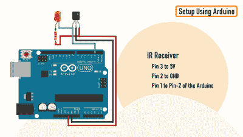

# 红外远程测试器帮助你破解密码

> 原文：<https://hackaday.com/2022/11/08/ir-remote-tester-helps-you-crack-the-code/>

即使一些设备现在使用 WiFi 和蓝牙，我们的许多家庭娱乐设备仍然依赖于自己专有的红外遥控器。总的来说(当你能找到它们的时候)它们工作得很好，但是当它们停止工作的时候会发生什么呢？当然，首先要做的是更换电池，但是一旦你尝试了，接下来你会做什么呢？[浩克]用这个简单而有效的 [IR 远程测试器/解码器](https://hackaday.io/project/188139-ir-remote-tester-and-decoder)支持你。

How to connect the TSOP4838 to an Arduino to read the transmitted codes

通过使用一个廉价的集成红外接收器/解码器设备(古老的 [TSOP4838](https://www.vishay.com/docs/82459/tsop48.pdf) )，大部分艰苦的工作都为你完成了！为了快速直观地检查您的遥控器是否正在发送代码，它可以轻松地驱动一个可见的 LED，只需一个限流电阻器和一个电容器，使闪烁更容易看到。

对于 encore，[Hulk]展示了如何将它连接到 Arduino，以及如何使用“非远程”库来查看按钮被按下时传输的实际数据。

一旦你收到了这些信息，想象一下你还能做些什么是不难的——控制你自己的项目，克隆红外遥控代码，自动化遥控序列等等..

这是一个让不可见的变得可见的好方法，并且可以添加一些有用的调试信息。

我们最近报道了一个[更复杂的红外克隆器](https://hackaday.com/2022/10/03/your-own-home-ir-cloner/)，如果你需要组装一个真正通用的遥控器，那么[这个项目可能正是你所需要的](https://hackaday.com/2022/02/10/ir-translator-makes-truly-universal-remote/)。

 [https://www.youtube.com/embed/g0SWwadlrkk?version=3&rel=1&showsearch=0&showinfo=1&iv_load_policy=1&fs=1&hl=en-US&autohide=2&wmode=transparent](https://www.youtube.com/embed/g0SWwadlrkk?version=3&rel=1&showsearch=0&showinfo=1&iv_load_policy=1&fs=1&hl=en-US&autohide=2&wmode=transparent)

