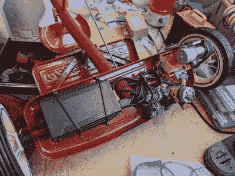

# 三轮车上的提线木偶

> 原文：<https://hackaday.com/2022/11/12/a-muppet-on-a-tricycle/>

[唐纳德·贝尔]想重现他参加的 2018 年纽约创客节上看到科米骑在三轮车上的神奇，所以他创作了自己在无线电传单儿童三轮车上的[布偶。](https://www.instructables.com/Remote-Controlled-Tricycle-Riding-Puppet/)

他首先将一个现成的木偶绑在一辆经典的无线电传单双层幼儿三轮车上，使用拉链和分裂管道绝缘材料来增加四肢的硬度。[Donald]然后将所有电子设备，包括 12 V 50 RPM DC 电机、24 V 22.4 Ah 锂离子电池组、TB67H420FTG 电机驱动器和 Arduino Uno 微控制器放在后桥下方。

电机通过滑轮和同步带将动力传递给其中一个后轮，另外一个 ASMC-04B 24 V 伺服系统用于通过钢制推杆操纵三轮车。遥控通信是通过 FlySky FS-GT2 2.4 GHz 双通道系统完成的。[Donald]在谷歌文档中为想要了解更多信息的人提供了一份详细的零件清单。

[Donald]详细讲述了该建筑的局限性，包括底部电子设备的低间隙、同步带的挑剔以及木偶大小给不经意的观察者带来的“恐怖谷”。无论如何，这个版本是非常特别的，它为任何想要将这个想法进一步扩展到令人毛骨悚然或可爱的领域的人铺平了道路。

用机动控制改装车辆是人们的最爱，就像过去制造商费尔斯的一些项目一样。

 [https://www.youtube.com/embed/0MnU_cPxSVU?version=3&rel=1&showsearch=0&showinfo=1&iv_load_policy=1&fs=1&hl=en-US&autohide=2&wmode=transparent](https://www.youtube.com/embed/0MnU_cPxSVU?version=3&rel=1&showsearch=0&showinfo=1&iv_load_policy=1&fs=1&hl=en-US&autohide=2&wmode=transparent)

