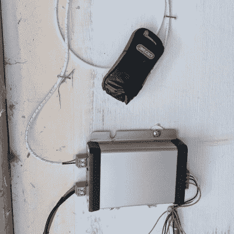

# 自行车头盔上的 RFID 标签允许进入车库

> 原文：<https://hackaday.com/2022/11/13/rfid-sticker-on-bike-helmet-grants-garage-access/>

[Glen]可能会将他的项目描述为通过自行车头盔上的 RFID 标签打开车库门很简单，但他需要做的一些接口工作相当复杂。他从头到尾看了一遍这个项目，从中可以学到很多东西。

当设计 RFID 访问控制系统时，必须决定希望使用哪种类型的读取器和哪种类型的标签。它们的功能或多或少都是一样的，但是有许多实际的考虑要考虑，例如成本、范围、易用性和安全选项。经过大量研究后，[Glen]决定采用廉价的贴纸式标签和兼容的读卡器，支持带有 ISO14443 UID 的凭证，可以适当地安装在建筑物的外部。

The actual opening of the door was the simple part, done by interfacing to a spare remote.

对于某些 RFID 阅读器来说，有现成代码库的分线板，但对于[Glen]拥有的阅读器来说，情况并非如此。他最终滚动自己的代码来处理与阅读器的通信，用一个微芯片 PIC18F45K50 来完成读取标签和执行访问控制的所有工作。他的代码在[项目的 GitHub 库](https://github.com/bikerglen/simple-access-controller)上，如果你也发现自己需要与使用 Wiegand 协议的阅读器接口，你可能想看一看。

控制真正的车库门是容易的部分。所需要做的就是在备用车库门遥控器的开关触点上焊接两根电线，并使用一个继电器来闭合触点。简单有效。你可以在短片中看到它的作用，嵌入在休息下面。

头顶门访问控制可能是一个简单的概念，但当有进取心的黑客开始寻找解决方案时，它会以各种形状和大小出现。我们已经看到车库门被赋予了 DIY 物联网待遇，甚至看到由汽车前灯闪烁控制的 T2，这实际上比听起来更安全。

 [https://www.youtube.com/embed/BHS816K3yuk?version=3&rel=1&showsearch=0&showinfo=1&iv_load_policy=1&fs=1&hl=en-US&autohide=2&wmode=transparent](https://www.youtube.com/embed/BHS816K3yuk?version=3&rel=1&showsearch=0&showinfo=1&iv_load_policy=1&fs=1&hl=en-US&autohide=2&wmode=transparent)

