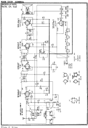
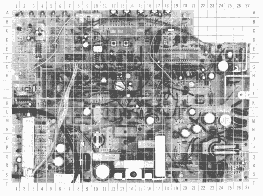
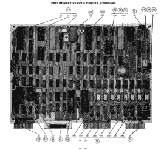

# 怎么修？图表之死

> 原文：<https://hackaday.com/2022/11/21/how-to-repair-the-death-of-schematics/>

曾几何时，如果你能熟练使用烙铁，你可以很容易地开一家收音机或电视机修理店。你可能不会变得富有，但你可以过上好日子。如果你有足够的商业头脑去做销售，你会做得很好。如今没有多少修理店，这没什么好奇怪的。劳动力价格上涨，电视等商品的价格每天都在下降。更糟糕的是，今天的电视不仅比去年的型号更便宜，而且可能更好。除此之外，电视充满了你得不到的定制部件，并被塞进越来越小的盒子里。

举个例子，我看到一个“黑色星期五”广告，一个 40 英寸的 1080p 平板电视，带流媒体控制器，售价 98 美元。当然，以今天的标准来看，这并不算大，而且我肯定这不是一张完美的照片。但是为了 98 美元？如今，即使是一台巨型高品质电视的价格也可能略高于 1000 美元，而你可以用不到 500 美元的价格买到非常棒的东西。

回顾过去，1980 年，西尔斯的一则广告在一台 19 英寸的彩电上展示了很多东西。价格？$399.这听起来并不太糟糕，直到你意识到今天这将是大约 1400 美元。因此，按照大约 3.5 比 1 的比率，每小时 30 美元的服务呼叫在今天将是 105 美元。因此，对于一个小时的无零件服务呼叫，我可以只购买 40 英寸的电视。哪怕只增加一个简单的部分或一个小时，我就能接近大联盟的电视了。

你有没有想过电视维修技师是怎么知道该做什么的？首先，大多数时候你不需要这么做。数量惊人的电话可能是一些简单的事情，如磨损的电话线或脏的调谐器。被动物毁坏的天线很常见。在电子管时代，你可以很容易地更换电子管来解决大部分实际问题。

## 回到商店:骑手和萨姆

许多商店会派一个初级人员去检查简单的东西，然后把其他东西“带回商店”,在那里知道该做什么的人会在组件级别进行故障诊断。令人惊讶的是，许多电视和其他消费电子产品曾经在服务人员的柜子里有原理图。不过，它们经常被挤在一起。

A Rider page for an Admiral radio

有更好的选择。莱德会从他们能找到的所有消费电子产品中获取数据，然后大量出版，有时一年总共有 2000 页。这些旧卷中的许多都可以在互联网上找到。

服务数据的另一个主要发布者是 Sams Photofacts。这些文件夹将有关于主要电视、收音机、CB 发射机的详细信息，在少数情况下，还有计算机。

Sams 仍然存在，仍然会向你出售他们的照片，所以他们很难在网上找到。然而，如果你看一下，周围还有[一些。你也可以像买二手书一样经常买二手原版。显然，一些老版本的版权已经过期，也有第三方会出售这些版本。有时你也可以在图书馆找到它们。](https://archive.org/search.php?query=sams+photofact&sin=)

照片事实文件夹通常非常详细。它们会显示拆卸说明，除了原理图，还会显示齿轮的额定工作波形。经常可以看到一张印刷电路板的图片，上面有字母和数字的网格，可以帮助你在拥挤的电路板上找到零件。

  A grid helped Photofact users locate components  Schematics had nominal waveforms attached  There were even “Computerfacts” for computers like the TRS-80 Model 4

这些类似于人们经常购买的汽车手册。大多数维修店会把这些买下来，保存起来，以防某个品牌的电视机再次出现，或者同一台电视机以后需要维修。

## 部件

零件可能也更容易找到。现在，您有许多专有芯片和组件，它们很难获得，甚至可能没有标记。当然，地铁无处不在。对于其他零件，维修店通常依赖分销商，如后来成为 NTE 的 ECG。他们会把适用性广的零件包装起来。他们还制作了交叉参考书籍，告诉你可以用什么零件来替换普通的消费电子产品零件。

RCA 也提供了类似的服务，RCA SK 晶体管和摩托罗拉有 HEP 作为他们的品牌名称。一般来说，与业余爱好者可能支付的费用相比，这些零件非常昂贵，但它们很容易获得，并且众所周知适合，因此它们经常用于服务行业。 [NTE](https://www.nteinc.com/quickcross/) 仍然存在，你有时会发现商店里有 ECG 或 SK 零件库存，通常是悬挂塑料袋或泡罩包装。

## 再利用，回收

修理东西比丢弃它们更有吸引力。这应该对钱包有好处，当然对环境也有好处。然而，今天令人悲伤的是，许多东西被制造成不可修复的。即使有零件和原理图，除非你能像我们许多人一样自己动手，否则花钱请人来修理可能是不可行的。[时过境迁](https://hackaday.com/2016/05/03/retrotechtacular-tv-troubleshooting/)。当然，除非你能找到一家[修理咖啡馆](https://hackaday.com/2022/05/03/ask-hackaday-repair-cafe-or-not/)。