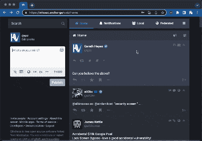

# 本周安全:乳齿象，假冒软件公司，和 ShuffleCake

> 原文：<https://hackaday.com/2022/11/18/this-week-in-security-mastadon-fake-software-company-and-shufflecake/>

由于 Twitter 在产品上测试新功能的新政策，对乳齿象作为潜在替代品的兴趣飙升。又有什么不爱呢？您可以自己托管它，它是 Fe variable 的一部分，您甚至可以运行其中一个实验性的分支来获得更多功能。但是将服务放在互联网上也有危险，讽刺的是，加雷斯·海耶斯从 infosec.exchange 实例中窃取密码就说明了这一点。

 每一个允许一个用户输入文本，然后将文本显示给其他用户的服务，都必须针对跨站脚本进行加固，XSS。这种攻击可以将 HTML 或 Javascript 注入到另一个用户的体验中。通常，这种强化是通过过滤用户输入来完成的。可能导致这种情况的两个特性是允许的 HTML 元素和特殊的解析特性。在这种情况下，这个特别的特性是半开玩笑的“已验证”图标，用户可以通过添加一个`:verified:`标签将它添加到他们的显示名称中。

乳齿象用包含双引号的 HTML `img`块替换标签来显示图标。当图标位于用户提供的 HTML 字段中时，就像一个`<ABBR title=""`标签一样，这变得很有趣。您的 ABBR 代码的双引号与验证图标创建的双引号不匹配，您可以突然注入各种有趣的代码。不过，大门并没有敞开，因为 Mastodon 有一个完善的内容安全政策(CSP)。它允许 iframes，但是不能从域外加载其他内容。这击败了许多普通的攻击，但是[加雷斯]有一个锦囊妙计——隐形形态。

像 Chrome 内置的密码管理器在自动填充表单方面相当激进，并且没有检查这些表单是否可见。唯一的难题是如何提交表格。这必须是用户发起的操作。这里的解决方案是伪造第二条消息，并在消息之间伪造工具栏。这不是一个完美的 0 点击利用，但结果是相当令人信服的。

[Gareth]向乳齿象和 Glitch fork 报告了该缺陷，并且两者都发布了补丁来减轻这种攻击的元素，尽管核心乳齿象实际上从未受到攻击，因为它首先不允许使用`<ABBR title="">`属性。

## 普什沃什

一家公司在一个地方注册，而在另一个地方开展业务，这种情况非常普遍。在美国，特拉华州是提交公司章程的热门选择。顺便说一句，这就是为什么 Twitter 和 Musk 的官司会发生在特拉华州衡平法院——Twitter 是一家特拉华州的公司。更不符合犹太教规的是，一家总部设在一个国家的公司，却声称总部设在另一个国家，却没有书面记录可供披露。这似乎正是 Pushwoosh 要做的事情。

这将是一个相对无趣的故事，除了这样一个事实，即 Pushwoosh 似乎实际上是以俄罗斯为基地的，并且已经接受了国防部的工作合同。看起来一些数据处理发生在 Pushwoosh 服务器上，包括地理位置数据的收集。目前还不清楚是否有任何恶意行为，但这不是美国政府愿意冒的风险。

## Shufflecake 带来了否认

还记得 Truecrypt 吗？这是磁盘加密软件，有一些奇特的额外功能，如隐藏卷似是而非的抵赖。您可以设置一个加密卷，在给定一个密码时显示一组文件，而给定另一个密码时显示另一组文件。几年前，Truecrypt 的开发在一次奇怪的事件中被放弃了。现在有了一个新项目，旨在填补貌似合理的否认差距，即[shuffle take](https://research.kudelskisecurity.com/2022/11/10/introducing-shufflecake-plausible-deniability-for-multiple-hidden-filesystems-on-linux/)。

它是开源的，作为 Linux 内核模块和用户空间工具运行，并支持 15 层的嵌套隐藏卷。加密卷存储在未使用的块设备空间中，与磁盘上的随机位完全无法区分。在解密和安装时，似乎是可否认的，因为您可以用一个密码解密外部卷，并且在给出有效密码之前，不可能知道是否存在任何附加卷。

## F5 BIG-IP CSRF

Rapid7 的[Ron Bowes]进行了一些有趣的研究，在 F5 BIG-IP 和 BIG-IQ 设备上实现远程代码执行。这些强大的网络设备在 ISP 规模上进行流量整形，它们在引擎盖下运行 CentOS。F5 做了很多正确的事情，比如启用 SELinux，这显然使得开发更加困难。问题在于缺乏跨站点请求伪造(CSRF)保护的 API 端点，并且这些端点可以从在被访问的网页上运行的脚本中调用。攻击是欺骗管理员加载这样的页面，然后劫持现有的会话 cookie 来调用 API。

为了转向代码执行，滥用了 RPM 规范生成器，并注入了一个`%check`命令。这在合法的 RPM 包中用于启动安装后测试，但在这里用于启动 webshell。其他一些弱点被链接在一起，以达到根级别的访问。该研究报告给了 F5，并于本周发布了修复程序。

## 像素 6 第二和第三部分

我们讲述了这个故事的第一部分和第二部分的[，但是为了完成这个循环，现在可以看到第三部分](https://eshard.com/posts/pixel6_bootloader)[，讲述 Pixel 6 引导程序是如何被破解的。这里的第一个障碍是找到一段标记为可读、可写和可执行的内存。然后，获得将在这种环境中实际执行的 shell 代码是一个挑战，但是只需编写 makefile 向导就可以生成所需的代码。这三篇文章是关于如何破解 Android bootloaders 的很好的入门。](https://eshard.com/posts/pixel6_bootloader_3)