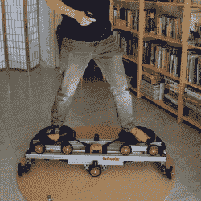

# DIY 机器人平台旨在解决虚拟现实中的行走

> 原文：<https://hackaday.com/2022/11/18/diy-robotic-platform-aims-to-solve-walking-in-vr/>

[马克·杜福尔]的 [TACO VR 项目](http://blogfarts.blogspot.com/2022/03/taco-vr-infento-based-omnidirectional.html)是一种模仿全方位跑步机的机器人平台，旨在提供一种紧凑且易于运输的方式，让用户在虚拟现实中自然行走。

 对于大多数允许用户在虚拟现实中行走的解决方案，马克并不热心，他采取了一种完全不同的方法。其结果是一个机器人平台，适合放在一个小区域内，其两侧折叠起来便于运输；打包后，它就像一个玉米卷。部署时，想法是让两个盘状平台始终停留在用户的脚下，使用户保持在一个地方，而他们则正常行走。

这是一个雄心勃勃的项目，但[Mark]能够胜任这项任务，而且该项目的 GitHub 仓库拥有保持最新状态或参与其中所需的一切。硬件现在主要集中在功能上；当然，使用原型时摔倒或绊倒看起来会很不舒服，但这个想法很有创意。

When stowed for storage or transport, the system resembles a taco.

在虚拟现实中，运动问题作为一个整体仍然没有完全解决。在这个空间里，有灵感的爱好者绝对可以以一种有意义的方式进行实验和创新。毕竟, [Gorilla Tag](https://gorillatagvr.com/) 中独特的运动系统——一款 VR 多人游戏，玩家是无腿的大猩猩，只用手臂移动——是一个巨大的成功，是一个受启发的开发者的作品。绝对有实验的空间。

TACO 平台是一项正在进行的工作，但是各个部分正在整合。你可以在下面的视频中看到一个测试，其中两个绿色标记代表一个用户的脚。观察两个平台移动和旋转，以保持在用户(模拟)的脚下，这意味着用户可以正常行走，但不能移动。

 [https://www.youtube.com/embed/VliX2Mjm0tE?version=3&rel=1&showsearch=0&showinfo=1&iv_load_policy=1&fs=1&hl=en-US&autohide=2&wmode=transparent](https://www.youtube.com/embed/VliX2Mjm0tE?version=3&rel=1&showsearch=0&showinfo=1&iv_load_policy=1&fs=1&hl=en-US&autohide=2&wmode=transparent)

