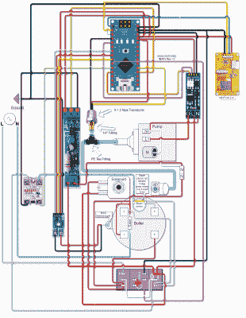

# 用 Gaggiuino 改装的自制浓缩咖啡机

> 原文：<https://hackaday.com/2022/11/20/homebrew-espresso-maker-modding-with-gaggiuino/>

对于那些不知道的人来说，Gaggia 是一家生产平价“入门级”浓缩咖啡机的公司，这些咖啡机以合理的价格提供优质的消费级浓缩咖啡机。入门级机器不提供对温度、压力和蒸汽的精细控制，而这正是 Gaggiuino 项目的切入点。

Gaggiuino 项目是许多浓缩咖啡机的“售后”改造，如 Gaggia classic 和 Gaggia classic pro。主要增加了一个 MAX6675 热电偶模块和一个 K 型热电偶传感器，对温度进行闭环控制。增加一个连接到泵电机的交流调光器模块和一个 0 Mpa 到 1.2 Mpa 范围的 XDB401 压力传感器的选项，安装在泵和锅炉之间的管线中，提供对压力和流量分布的进一步闭环控制。

称重传感器可以连接到滴盘上，以提供关于倾倒重量的反馈，Nextion 2.4”LCD 触摸屏提供了用于轮廓选择和其他交互的用户界面。该项目提供了一个“基础”修改，使用 Arduino Nano 作为微控制器，与其同名，但也有一个 STM32 Blackpill 模块的选项，可以提供 Nano 范围之外的更多功能。

Gaggiuino 项目是开源的，在 GitHub 上有[代码](https://github.com/Zer0-bit/gaggiuino/)和大量[文档](https://gaggiuino.github.io/#/gc/gaggia-classic)。还有一个 [Discord 社区](https://discord.gg/eJTDJA3xfh),供那些想要帮助他们构建或者有兴趣与 Gaggiuino 分享他们对 DIY 浓缩咖啡调制的热情的人使用。浓缩咖啡机黑客是我们的最爱，我们已经介绍了许多关于浓缩咖啡机制造和改装的项目，从经典浓缩咖啡机的 [PID 控制](https://hackaday.com/2015/07/06/restoring-an-espresso-machine-to-the-21st-century/)到[精美的最小闭环自制浓缩咖啡机](https://hackaday.com/2021/03/04/homebrew-espresso-machine-has-closed-loop-control/)。

 [https://www.youtube.com/embed/MxPNQRCxQZc?version=3&rel=1&showsearch=0&showinfo=1&iv_load_policy=1&fs=1&hl=en-US&autohide=2&wmode=transparent](https://www.youtube.com/embed/MxPNQRCxQZc?version=3&rel=1&showsearch=0&showinfo=1&iv_load_policy=1&fs=1&hl=en-US&autohide=2&wmode=transparent)

感谢[Chempy]的提示！