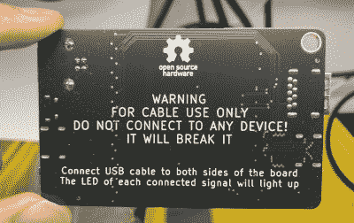

# 一个方便的 OSHW USB 电缆测试仪为您的工具包

> 原文：<https://hackaday.com/2022/11/20/a-handy-oshw-usb-cable-tester-for-your-toolkit/>

承认你被廉价的 USB 电缆烧伤过并不可耻——自从一些算账的人意识到生产“仅供电”USB 电缆可以节省几分钱以来，没有一个硬件黑客是安全的。[但是有了这个来自【Á·阿尔瓦罗·彼尔托】](https://github.com/alvarop/usb_c_cable_tester)的简单测试器，你再也不会被骗了。

这是一个尽可能直截了当的设计，只使用了 24 个 led、相关的电阻和一个普通的 CR2032 纽扣电池。只需将电缆的两端插入测试仪上的各种 USB 连接器，即可完成必要的电路，点亮相应的 led，立即告诉您电缆中有多少根完好的电线。因此，无论您是在处理一些没有完整导体的可疑电缆，还是有一些物理损坏切断了一两个连接，您一眼就能知道。

A sage warning for most of the devices we build.

显然，测试仪主要是为你在一个合适的 USB-C 连接器中找到的 24 针而设计的[，但它完全向后兼容旧的电缆和连接器。我们很欣赏他甚至包括矮胖的 B 型连接器，这是我们一直喜欢的，因为它比更常见的迷你和微型连接器更坚固。](https://hackaday.com/2016/04/22/hackaday-dictionary-usb-type-c/)

请记住，虽然这个测试仪只会告诉你，如果有两个引脚之间的连接，它不会验证它实际上可以处理多少功率。为此，[你需要一些额外的设备](https://hackaday.com/2018/02/02/careful-testing-reveals-usb-cable-duds/)。