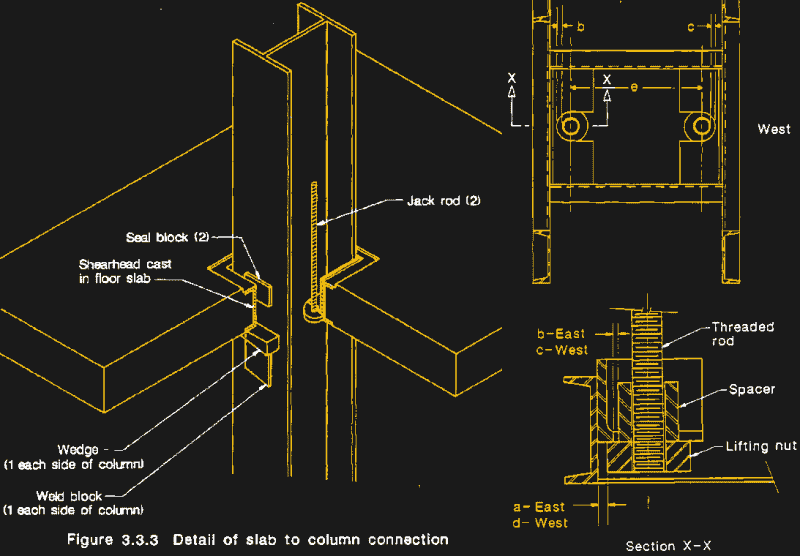

# 你应该读的书:为什么建筑物会倒塌

> 原文：<https://hackaday.com/2022/11/23/books-you-should-read-why-buildings-fall-down/>

通勤时间长的人通常会想出一些办法来保持注意力和警觉，避免开车时走神的危险倾向。我过去经常使用的一个技巧是在脑海中记录我上班路上经过的各种建筑项目，注意新的高速公路立交桥上的哪些桥墩接近完工，或者观看钢铁工人组装一段新道路的复杂钢筋内骨骼。

在 80 年代，我喜欢看的一个项目是高速公路旁边的一座新的高层建筑，它的建筑方法让我着迷。工人们似乎是在地面上建造每层楼，然后用千斤顶将它们支撑在垂直的钢柱上，而不是组装一个钢架，铺设甲板，并用混凝土覆盖每层楼。我对此很着迷，因为每次我经过的时候，楼层都在不同的位置，随着建筑的增长垂直向外延伸。

然后有一天，它不再存在了。那里有九层楼高的柱子伸向城市的天空，混凝土板排成一行，准备被顶入它们最终的位置，那里只有一个巨大的洞，一团可怕的灰色混凝土灰尘从地上升起。那是 1987 年 4 月 23 日，康涅狄格州布里奇波特的一座名为 [L'Ambience Plaza](https://connecticuthistory.org/the-collapse-of-the-lambiance-plaza/) 的豪华公寓楼被夷为平地，埋葬了 28 名建筑工人的尸体。

## 纸牌屋

Matthys Levy 和 Mario Salvadori 在 1992 年写的书《为什么建筑会倒塌》(Why Buildings Fall Down)中包含了许多案例研究，而环境广场的倒塌只是其中之一。这本书出版后不久，我偶然发现了它，并立即被它吸引，因为我与 L ' envelope 广场倒塌事件有联系；那天我上班的地方实际上是邻近城市一家救护车公司的紧急医疗技术员，所以当我路过时，我的许多朋友都在那个洞里试图营救建筑工人，那天晚些时候我实际上去了现场志愿服务。当我读这本书的时候，我已经脱离了 EMS 行业，对那天出了什么问题的工程方面更感兴趣，这本书提供了关于 L ' envelope Plaza 的详细案例研究，满足了我对那天发生的事情以及十几个其他结构故障的好奇心，其中大多数也导致了至少一些生命损失。

书中的每个案例研究都附有凯文·沃斯的简单而出色的图表，使人们很容易理解每个失败的根本原因。对于 L ' environment 广场，螺纹千斤顶杆被发现穿过钢提升框架中的槽而不是孔，这将防止它们滑出并开始逐渐倒塌，从而导致建筑倒塌。这些图表使这一点变得非常清楚，并且很容易理解为什么该机制是以这种方式构建的；在工作现场，将 1-1/4”的螺杆穿过孔比将提升螺母滑入槽中要困难得多。但是也很容易看出螺母是如何从槽中滑出并在这个过程中引起许多麻烦。

Detail of lift-slab mechanism from L’Ambience Plaza. The lifting nuts fit into slots in the lifting head and slipped out under load. Source: [National Bureau of Standards Report](http://www.nist.gov/customcf/get_pdf.cfm?pub_id=908893)

## 铁锈、水、风和人为错误

腐蚀和金属疲劳在书中也有很好的表现，从喷气式飞机时代开始时由于飞机方形窗户角落的应力集中而导致的多次彗星航班坠毁，到 1980 年康涅狄格州米安纳斯河大桥的倒塌——我的家乡在书中表现得相当糟糕，总共出现了三次故障——部分原因是悬跨桥的吊架组件生锈。还有一个部分致力于处理自然母亲带来的特殊问题，包括 1987 年纽约高速公路上的 Scoharie Creek 桥倒塌事件，这对于结构工程师来说不是一个好的十年，这要感谢 Creek 的洪水冲刷了桥墩下的材料。如果没有对“飞奔的格蒂”的讨论，哪本关于结构故障的书会是完整的呢？这座横跨塔科马海峡的著名柔性吊桥在 1940 年开通后不久，由于风力和共振，经历了快速的意外拆卸。

然而，并不是书中的每一个结构故障都有经典的工程根源。有时，这也有社会工程的一面，就像 1980 年堪萨斯城凯悦酒店天桥倒塌的情况一样，就 9/11 之前的生命损失而言，这是美国历史上最严重的结构性故障。导致 114 人死亡、200 多人受伤的那次坍塌，涉及到一组穿过中庭的悬空走道，这些走道连接着豪华酒店的两个街区，由坚固的螺纹杆悬挂在天花板上。问题是原来的设计很难在工地上制作，所以承包商建议修改设计。不幸的是，最初的工程师没有真正考虑清楚就签署了变更；由此导致的人行道负荷分布的变化最终将整个结构撕裂。那个对我来说特别可怕；有多少其他工程师在没有进行至少一些计算的情况下，就批准了一个看似无害的改变？

 [https://www.youtube.com/embed/VnvGwFegbC8?version=3&rel=1&showsearch=0&showinfo=1&iv_load_policy=1&fs=1&hl=en-US&autohide=2&wmode=transparent](https://www.youtube.com/embed/VnvGwFegbC8?version=3&rel=1&showsearch=0&showinfo=1&iv_load_policy=1&fs=1&hl=en-US&autohide=2&wmode=transparent)

## 你不知道，直到你知道

我认为，所有这些失败让我想到的是，结构工程有时会多么接近边缘，尤其是在试图做出创新和美丽的东西时。在一个建筑中投入足够多的钢筋和混凝土，你很有可能得到经得起时间考验的东西。但是，如果你试图突破极限，建造一些轻便、通风而不是极端功利的东西，工程问题就有点棘手了。找到合适的位置来放置结构构件，以承载预期的负载，同时又不影响美学设计，这是一个更大的挑战，有时工程师就是做不好。这有点可怕，因为我们都经常在结构中，在结构上，或在结构附近，这可能会推动结构的外壳。

当然，大多数结构经受住了时间的考验，灾难性的失败是很少的。但是有足够多的例子让像《为什么建筑物会倒塌》这样的书成为可能，如果你有兴趣知道工程师最糟糕的噩梦是什么样的，这本书绝对值得一读。对我来说，这本书实际上为我那天所看到的，以及所有因为它而在我脑海中出现的工程问题提供了一些答案。