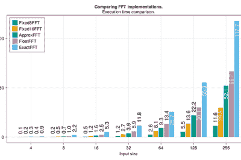

# 西方最快的傅立叶变换

> 原文：<https://hackaday.com/2022/11/23/the-fastest-fourier-transform-in-the-west/>

时变波形的一个有趣方面是，通过使用一种称为傅立叶变换(FT)的技巧，它们可以表示为其基本频率之和。当以数字方式处理信号时，这种数学见解非常有用，并且允许以更简单的方式在数字系统中实现频率相关滤波。[klafyvel]在一个项目中需要这项功能，所以开始研究适合 Arduino Uno 的最佳方法。为了更好地理解到底发生了什么，他们在代码长度、执行时间和准确性上有了很大的提高。

完整的实时傅立叶变换是一项资源密集型操作，Arduino Uno 无法提供所需的资源，因此多年来开发了更快的近似算法，以绝对精度换取速度和大小。这些被称为快速傅立叶变换(FFT)。[klafyvel]开始深入研究相关的数学以及一些低级编程技术，以确定现有解决方案中提供的权衡是否已经优化。结果令人印象深刻。

Benchmarking results showing speed of implementation versus the competition (ApproxFFT)

不满足于产生一个新的获奖算法，博客上记录的[是真正理解问题的大师级课程，根据您对执行速度、准确性、代码大小或数组大小的重要性的排序，至少有四种算法可供选择。](https://klafyvel.me/blog/articles/fft-arduino/)

在这个过程中，我们经历了一些很大的转变，比如如何通过指数来近似浮点数(法语文本)，如何使用 T2 茱莉亚来控制、编程和收集来自 Arduino 的数据，如何通过使用 T4 三角恒等式来大幅提高代码的速度，以及如何在变量变得太大时处理溢出。这里有很多东西需要消化，但是解释非常清楚，并穿插了代码片段，使它更容易，如果你有时间通读，你一定会学到很多东西！GitHub 上的代码是[这里是](https://github.com/Klafyvel/AVR-FFT/tree/main)。

如果你对快速傅立叶变换感兴趣，我们以前在这附近见过。用标签项目的链接填满你的靴子。