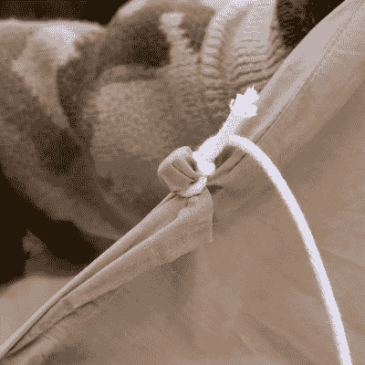

# 五金店化学品把床单变成防水油布

> 原文：<https://hackaday.com/2022/11/23/hardware-store-chemicals-transform-sheets-into-waterproof-tarps/>

对于北半球的黑客来说，潮湿寒冷的季节即将来临。保持干燥和保持温暖一样重要，所以有什么比一两次锻炼让我们保持温暖和干燥更好的呢？你所需要的只是一张床单，一些绳子，跑一趟当地的五金店，以及一些知识。[NightHawkInLight]为我们带来了精彩的视频“[回收的床单是最好的防水油布](https://www.youtube.com/watch?v=z_R0gEDZhAI)”，如下图所示。

【NightHawkInLight】将古老的传统方法带入 21 世纪，摒弃了油、蜂蜡和帆布，转而使用硅树脂制成的可回收床单。该视频足够详细，因此您可以重现他们的结果，而不必担心使用强力溶剂。

廉价的五金店级硅酮密封胶被石脑油稀释，加工成旧床单，然后挂出来晾干一夜。结果呢？一种完全防水的床单，和治疗前一样柔韧。但是当没有孔眼时，你怎么能像防水布一样使用它呢？如果你看这个视频没有其他原因，看看结尾的整洁的附件技巧，传统技术再一次被带到了前台，只不过是一块石头和一个活结。

我们可以想象这种便宜、耐用的自制防水布有很多用途。也许你可以在建造自己的[定制自行车露营车](https://hackaday.com/2022/06/18/custom-cycling-camper-continues-car-free/)时使用它。

 [https://www.youtube.com/embed/z_R0gEDZhAI?version=3&rel=1&showsearch=0&showinfo=1&iv_load_policy=1&fs=1&hl=en-US&autohide=2&wmode=transparent](https://www.youtube.com/embed/z_R0gEDZhAI?version=3&rel=1&showsearch=0&showinfo=1&iv_load_policy=1&fs=1&hl=en-US&autohide=2&wmode=transparent)

