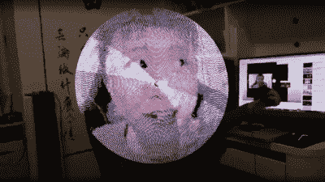

# 使用 ESP32 整理 POV 显示

> 原文：<https://hackaday.com/2022/11/23/tidy-pov-display-using-the-esp32/>

中国的 YouTube[corebb]展示了他的 POV 展示的第二个版本。早期版本使用 5050 尺寸的 SMT 可寻址 led，这并没有提供很高的分辨率，所以他 [改进了设计，使用更多数量的](https://www.youtube.com/watch?v=HpYd48YgSek) (准确地说是 160 个)APA102 LEDs。这些是 2 毫米的边，使他们更难处理，所以在一些最初的锡膏晃动后，他决定使用一个合同组装厂来为他做棘手的事情。这失败了，因为他们没有“理解”零件，并把它们放在了错误的方向！但他没有被吓住，他又用修改过的焊料模板试了一次，最终让整条焊料正确地点亮了。

基于一个 ESP32(使用 [Arduino 堆栈](https://github.com/RealCorebb/bbPOV-P/tree/main/Arduino) )和 SDCard 进行控制，以及一个无线充电的 LiPo cell，构建相当整洁。两个霍尔效应开关安装在两个臂的开始，大概是内衬

Real-time video streaming? Check!

箱子上的某个地方有一块磁铁，尽管这还不清楚。 [原理图](https://lceda.cn/editor#id=175a90ca59c540d4a20c7fb500604f29) 和 [PCB](https://lceda.cn/editor#id=d0adf8232add49e1aec5e9977feeb33d) 看起来是用 JLCEDA 设计的，是 EasyEDA 的重新包装。我们可以看到它与 JLC 和 LCSC 服务的高度集成的吸引力。看起来他甚至设法让流式视频工作起来——从网络摄像头显示实时视频——当你想到需要实时进行多少处理时，这是一项相当艰巨的任务。正如他在视频中提到的那样，以 ESP32 的处理能力，试图提高分辨率超过这一点是不可行的。

树脂印刷的外壳完成了制作，在后部增加了一个螺纹支架，允许使用典型的相机支架来固定东西。我们认为这是明智之举。

我们喜欢这里的视点显示器，这款 [球形视点显示器特别棒](https://hackaday.com/2020/12/18/edge-mounted-leds-make-this-spherical-pov-look-fantastic/) ，但是如果你有一个 [方便的吊扇和一点备用的原型板](https://hackaday.com/2022/11/09/1-pov-display-goes-round-and-round/) ，你就不需要花哨的硬件。

 [https://www.youtube.com/embed/HpYd48YgSek?version=3&rel=1&showsearch=0&showinfo=1&iv_load_policy=1&fs=1&hl=en-US&autohide=2&wmode=transparent](https://www.youtube.com/embed/HpYd48YgSek?version=3&rel=1&showsearch=0&showinfo=1&iv_load_policy=1&fs=1&hl=en-US&autohide=2&wmode=transparent)

感谢[mrx23dot]的提示！