# 一个黑客走进了一个贸易展览:2022 年电子展

> 原文：<https://hackaday.com/2022/11/22/a-hacker-walks-into-a-trade-show-electronica-2022/>

上周，世界上最大的电子产品交易会在慕尼黑举行，所以我必须参加。电子音乐节规模如此之大，以至于每两年才举办一次，并且填满了 14 个飞机库。顾名思义，它涵盖了所有与电子有关的东西。从你最喜欢的 MLCC 电容器的生产商到送货上门的公司，从 ASIC 测试设备的供应商到为你定制线圈的小店，范围相当广。四处走走，我看到了大玩家今天的未来技术，但我也获得了一些对家庭游戏玩家有用的想法。

[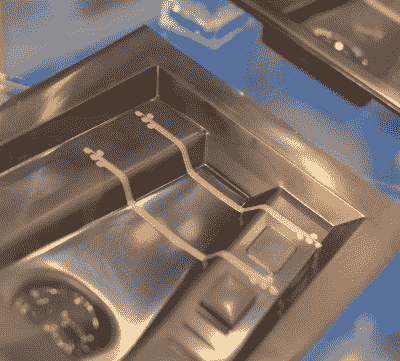](https://hackaday.com/wp-content/uploads/2022/11/DSCF3808.jpg) 比如，当我第一次走进 Elantas 展台时。他们是一家生产柔性绝缘材料和特种工业涂料的公司。但是引起我注意的是一个上面有电路痕迹的热成型塑料片。为了制造它们，他们切下铜箔，用有一点弹性的胶水把它粘到一个平的塑料片上，然后把它们放入一个真空成型器中。结果是一个 3D 电路和有机形成的基板在一个镜头。非常酷，而且没有一项技术是坚定的黑客力所能及的。

## 很酷的东西

所有的摊位，无论大小，都试图用一些噱头吸引你。那些财大气粗的大公司挂着巨大的招牌，开着酒吧，员工中不乏西装革履的销售人员。另一方面，小鱼们不得不向你展示他们做的很酷的东西，而且更多时候是应用工程师坐在那里，准备谈论技术。你可以猜猜我觉得哪个更有趣。

例如，当我走向一个显然是 DIY 的爆米花机，它也显示了 5000 FPS 的中期爆米花镜头时，我不得不问。该公司是一家英国小公司，生产定制可编程电源和与之接口的数字采集设备。你可以把它们的盒子插上一些温度探头，启动高速摄像机，不用写任何代码就能控制加热和冷却模式。非常甜蜜。

设计演示的工程师也在运行它，我们就如何测量温度进行了长时间的讨论。他把一个热电偶放在改装过的热枪上，一个放在爆米花粒里，另一个放在另一边。他把镜头从玉米粒上移开，但是在后玉米粒温度的记录中有一个奇怪的温度异常，因为爆开的爆米花会释放蒸汽，同时还是一个很好的绝缘体。我喜欢这种对疯狂细节的关注，而且[我用非常相似的方式烘焙自己的咖啡](https://hackaday.com/2018/01/23/build-an-excellent-coffee-roaster-with-a-satisfyingly-low-price-tag/)，所以我很同情。

 [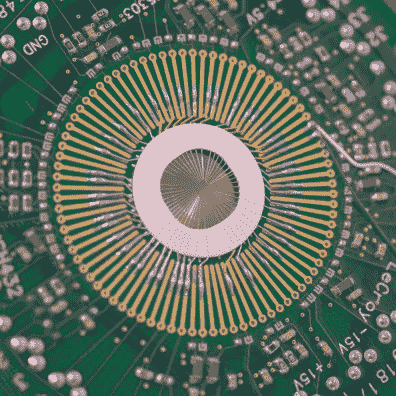](https://i0.wp.com/hackaday.com/wp-content/uploads/2022/11/DSCF3805.jpg?ssl=1) Your IC goes here [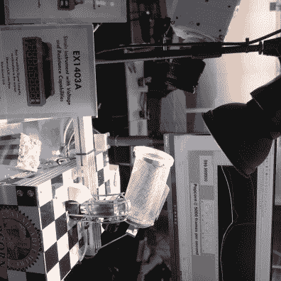](https://i0.wp.com/hackaday.com/wp-content/uploads/2022/11/DSCF3822.jpg?ssl=1) Popcorn at 5000 FPS

我和一位设计定制芯片测试设备的工程师进行了非常有趣的讨论。虽然它们大多是为较低的电压和电流设计的，但他讲述了难以置信的小测试引脚的故事，这些引脚仍然可以承载几十安培的电流。

一家制造电力电子设备和测试设备的公司赞助了亚琛工业大学的 T2 太阳能电动汽车团队，他们和一名参与该项目的大学生一起参观了他们的汽车。我肯定花了半个小时和他谈论他们的[世界太阳能挑战赛参赛车](https://hackaday.com/2020/12/21/world-solar-challenge-over-30-years-of-engineering-competition/)设计中的所有小细节。车上的几乎所有东西都是手工制作的，从超轻碳纤维框架到记录所有数据并将其转发给 chase van 的单板计算机，以及作为司机的通信渠道。太阳能汽车的游戏名称是空气动力学，汽车有挡泥板，以大约 5 毫米的间隙安装车轮，一个翼形太阳能电池板，和三个车轮，以绝对最小化置换的空气量。它的侧面有鲨鱼皮胶带，当我问及阻力系数时，他说这是一个秘密，但它是从小数点后的零开始的，即使经过四舍五入。呦喂。

 [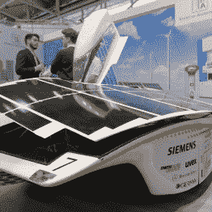](https://i0.wp.com/hackaday.com/wp-content/uploads/2022/11/DSCF3824.jpg?ssl=1) The real panels are too fragile [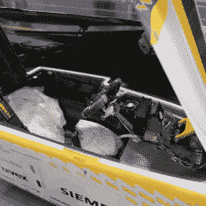](https://i0.wp.com/hackaday.com/wp-content/uploads/2022/11/DSCF3826.jpg?ssl=1) Custom everything [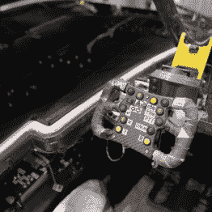](https://i0.wp.com/hackaday.com/wp-content/uploads/2022/11/DSCF3829.jpg?ssl=1) Computer is in the 3DP black box

例如，一家公司正在制造用于汽车应用的触觉致动器模块。基本上，你将塑料模制件背面的电容传感器带与他们的产品——一种类似扬声器的小型磁性设备——耦合，当你按下它时，它就会振动。这种效果很像按下手机屏幕时的触觉振动。但是，用一个小的扬声器线圈来做你通常用旋转重物做的事情的想法很有趣。

最后，我承认在测试和自动化部分花了太多时间，没有足够的黑客友好的收获来保证它。但是看着实时 BGA X 射线检测机、高速取放或 PCB 测试机器人做他们的事情实在是太酷了。

 [https://www.youtube.com/embed/iaLO5cxztcQ?version=3&rel=1&showsearch=0&showinfo=1&iv_load_policy=1&fs=1&hl=en-US&autohide=2&wmode=transparent](https://www.youtube.com/embed/iaLO5cxztcQ?version=3&rel=1&showsearch=0&showinfo=1&iv_load_policy=1&fs=1&hl=en-US&autohide=2&wmode=transparent)

## 下一个东西

微 LED 显示屏是新的热点。在这些展示中，迄今为止最令人印象深刻的是天马展台的一个 [114 DPI 屏幕。我对价格和可用性一无所知，如果你一定要问，你可能负担不起。我也不确定这有什么意义。他们将它们配置为汽车应用的 HUD，但它](https://usa.tianma.com/home/2022/06/29/tianma-invests-in-full-process-micro-led-experimental-platform)[失去了专用 HUD 的优点，即它可以聚焦到无限远处](https://hackaday.com/2021/08/19/why-you-cant-make-build-a-wearable-display-with-a-just-a-transparent-oled/)。但是就技术而言，它们看起来非常非常酷。我碰到了*迈克的电动工具*的【迈克·哈里森】，他想知道他是否能让他们进入一个艺术项目。

  114 DPI LEDs [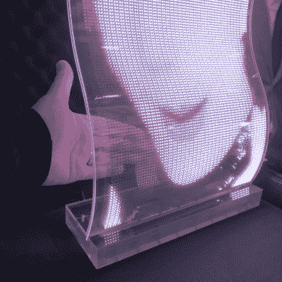](https://i0.wp.com/hackaday.com/wp-content/uploads/2022/11/DSCF3865.jpg?ssl=1) Bigger LEDs

有机太阳能电池对我来说是全新的，但我在电子博览会上碰到过两次。首先，我遇到了德拉库拉科技公司。(好听的名字！)他们制造可喷墨打印的有机太阳能电池，因此可以定制电池形状。不幸的是，它们目前针对的是定制生产。再说一遍，如果你一定要问…

后来，我在 [Epishine](https://www.epishine.com/) 展台前停下来，那里正在展示类似的有机太阳能电池，但是是以卷对卷的工艺将它们制成传统的正方形。现成的正方形没有定制的形状性感，但好处是你可以[现在就买。随着产量的增加，我们可能会等到价格稍微下降一点，但他们给了我一个评估套件，非常酷，在我明亮的办公室里，大约四个小时就可以为一个 0.4 F 的超级电容充电。](https://export.farnell.com/w/search/prl/results?brand=epishine)

[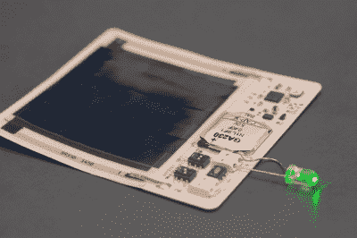](https://hackaday.com/wp-content/uploads/2022/11/DSCF3882.jpg)

A solar-powered LED. So you can see in the dark.

这两种有机太阳能技术都是在非常薄和灵活的塑料基板上，并且都被调整为最佳地收获你通常在室内发现的光量。[这个视频讲解者](https://www.youtube.com/watch?v=jdA4lWqFHB4)挺不错的。由于目标是室内环境照明，这些电池产生的功率是微瓦而不是兆瓦，但如果你想在室内部署一个低占空比的小型传感器设备，这样的东西可能就是合适的选择。

或者你可以驱动超低功耗显示器。在出去的路上，我路过 ynvisible，这家公司[使用聚合物电致变色墨水](https://www.ynvisible.com/segment-displays)制造显示器，碰巧和 Epishine 在同一家工厂。结果是低对比度和刷新缓慢的电子墨水，但在更薄的基板上，并使用纳瓦。因为显示器是丝网印刷的，定制显示器的安装成本也应该是可以承受的。在与一名工程师交谈时，他提到这项技术应该是可 DIY 的。有人更了解[电致变色聚合物](https://en.wikipedia.org/wiki/Electrochromism)吗？我喜欢它们淡入淡出的方式。

## 奇怪的东西:海滩上的电容器

站在不同的角度想一想。你经营着一家制造电阻器、编织线束或缠绕环形变压器的工厂。你打算在大型交易会上做些什么来吸引眼球？你打算如何安排这些压接连接器来吸引人流？我总是被那些不太性感的 T2 电子产品制造商所做的巧妙而荒谬的展示逗乐。因此，这是对我所谓的“海滩电容器”的致敬，既来自 2022 年，也来自 2018 年。

 [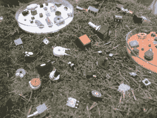](https://hackaday.com/dscf1085/) This is where we grow the trimpots [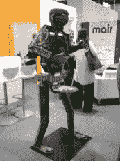](https://hackaday.com/dscf1108/) Well, hello! [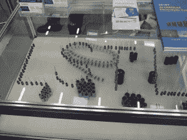](https://hackaday.com/dscf1086/) What if we spell out our name? [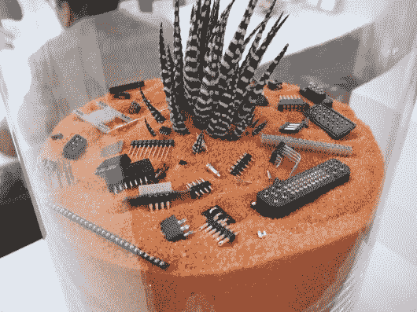](https://hackaday.com/dscf1084/) Connectors in the Desert [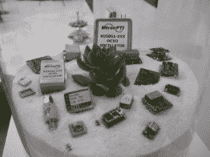](https://hackaday.com/dscf1083/) Timelessness and Timebases [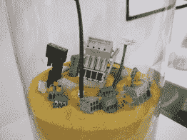](https://hackaday.com/dscf1082/) Wagos in the Wastes [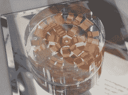](https://hackaday.com/dscf1080/) Copper clippies? [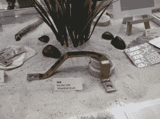](https://hackaday.com/dscf1079/) That’s not a bus bar, THIS is a bus bar [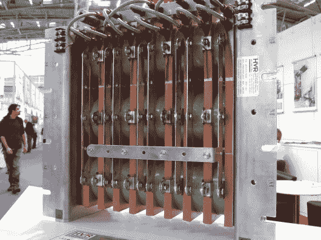](https://hackaday.com/dscf1078/) 3.5 MJ water-cooled resistors. For nuclear subs. [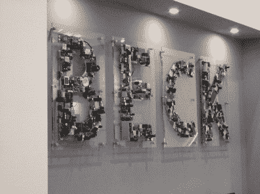](https://hackaday.com/dscf1074/) Well, it’s BECK. [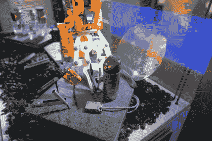](https://hackaday.com/dscf3871/) Company makes ASICS, but everyone loves robot arms [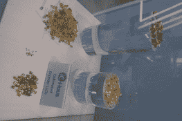](https://hackaday.com/dscf3854/) LEDs on a Pedestal [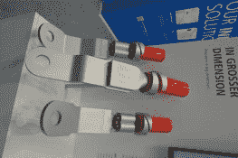](https://hackaday.com/dscf3852/) Literally 1 m tall spade connectors [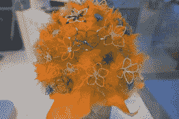](https://hackaday.com/dscf3851/) Ferrule Flowers [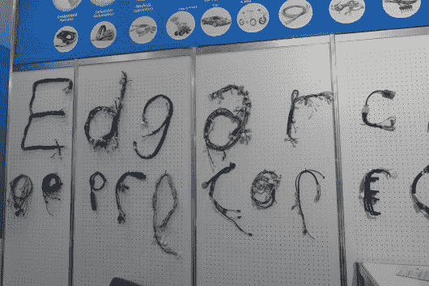](https://hackaday.com/dscf3844/) Edgar makes harnesses [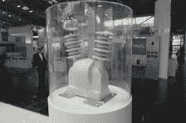](https://hackaday.com/dscf3830/) No explanation needed? [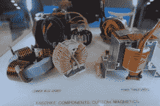](https://hackaday.com/dscf3820/) Transformers [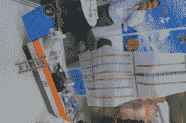](https://hackaday.com/dscf3818/) Set sail on the seas of resistors [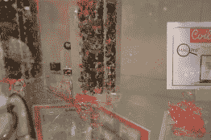](https://hackaday.com/dscf3819/) Coils in acrylic [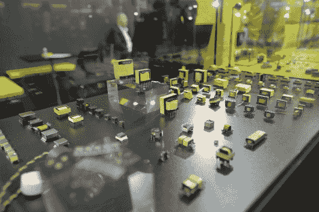](https://hackaday.com/dscf3812/) Tasteful transformers [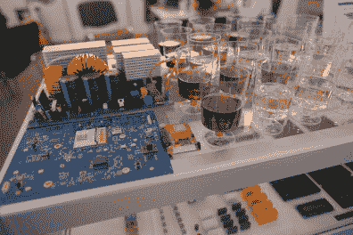](https://hackaday.com/dscf3811/) Come for the wine, stay for the PCBs [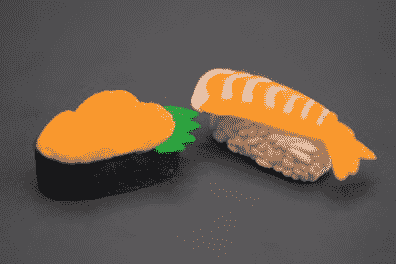](https://hackaday.com/dscf3880/) Taiyo Yuden was giving out plastic sushi and unmarked MLCC SMT caps. I took the sushi. [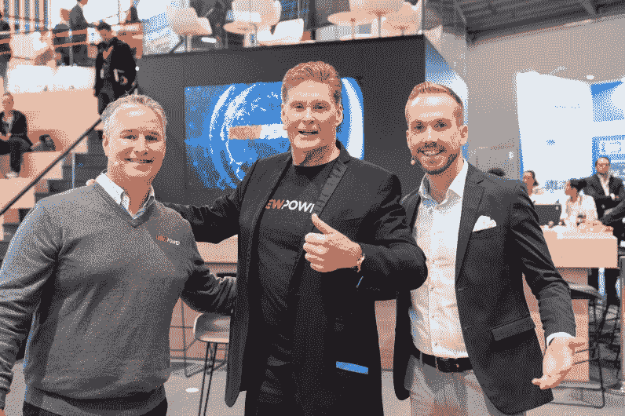](https://hackaday.com/electronica2022_mb_06556/) And David Hasselhoff. Photo Markus Broenner, Messe Muenchen

## 电子展 2024

我尽了最大的努力，但仍然有一些我从未去过的地方和我没有见过的人，因为我只在那里呆了两天。这是一个很大的节目，它让我的大脑变成了糊状，让我的脚起了水泡。但这是值得的。如果你能做一个，你绝对应该做。

人群的特色图片和 Markus brnner 的大卫·霍索夫缩略图，慕尼黑工业博览会版权所有