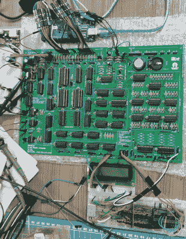

# 4 位复古学习平台 MikroLeo

> 原文：<https://hackaday.com/2022/11/27/mikroleo-a-4-bit-retro-learning-platform/>

MikroLeo 是一款基于 TTL 逻辑的分立微型计算机，由巴西巴拉那州巴西联邦学院的电子学教授[Edson Junior Acordi]设计，用于教育目的。 [4 位 CPU 有一个哈佛 RISC 架构，完全由 74HCT 系列逻辑](https://github.com/edson-acordi/4bit-microcomputer)构建，仅使用通孔部件安装在双面 PCB 上。凭借 2K 字的指令 RAM 和 2K 字的可寻址 RAM，CPU 的资源水平与以前的同类机器相似，让学生们感受到如何在严格的限制下工作。

[电路的模拟](https://github.com/edson-acordi/4bit-microcomputer/tree/master/Simulation)可以用[数字](https://github.com/hneemann/Digital)，用 KiCAD 设计的[专用 PCB](https://github.com/edson-acordi/4bit-microcomputer/tree/master/Kicad-files/MikroLeo) 来实现，所以应该有足够的地方可以用它来破解。四个 4 位 IO 端口使接口变得容易，专用的输入和输出指令用于此目的。一个汇编器、编译器和仿真器都在开发中(据我们所知),所以如果你对这个项目感兴趣，请密切关注。

我们有点喜欢这些地方的电脑，越“黑”越奇怪越好。即使只是在 4 位复古领域，我们也已经看到了很多，从围绕古代 ALU 芯片构建的[到由](https://hackaday.com/2012/05/15/building-a-4-bit-ttl-computer/)[分立晶体管和二极管](https://hackaday.com/2014/11/22/a-4-bit-computer-from-discrete-transistors/)构建的[，但你不需要走那条路，一个](https://hackaday.com/2012/05/15/building-a-4-bit-ttl-computer/)[仿真平台](https://hackaday.com/2020/12/23/4-bit-retrocomputer-emulator-gets-custom-pcb/)可以消除复古之痒，而没有相同程度的痛苦。