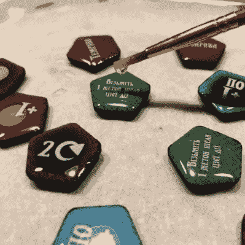

# 纸板游戏代币通过 DIY 处理变成闪亮的咔哒咔哒声

> 原文：<https://hackaday.com/2022/11/30/cardboard-game-tokens-become-shiny-click-clacks-with-diy-treatment/>

桌面游戏和纸板代币携手并进有一个很好的理由:它们既经济又有效。然而，它们的触觉属性还有待改进。高质量的作品拥有闪亮、令人愉悦的光滑度和纸板无法提供的*咔嗒咔嗒*手感，这真的很棒，但这一切都随着【Dzhav】的[简单方法而改变，只需一点点工作和树脂涂层，即可将纸板代币转化为豪华版的代币](https://boardgamegeek.com/thread/2974746/deluxifying-your-cardboard-tokens-covering-them-re)。

其结果是一个令牌上有一个水晶般透明，光滑，微微凸起的硬化树脂涂层。它们摸起来(听起来)像塑料，而不是纸板。所用的树脂是一种由两部分组成的透明珠宝树脂，用于铸造吊坠等物品。它的优点是工作时间长，与紫外线固化树脂(如 SLA 3D 打印机树脂)不同，它不会受到光线的影响。

Careful application of resin relies on surface tension to prevent messes.

像大多数事情一样，好的结果来自精心的准备和技巧。[Dzhav]建议通过用细砂纸打磨边缘使其完全光滑，然后用黑色记号笔给它们上色来准备代币。然后，用画笔和正确混合的树脂一次一面地涂抹代币:用牙签按住代币的同时，树脂被刷到(但不超过)边缘。然后，额外的树脂可以滴在令牌的中心，重力和表面张力将共同作用，以确保涂层均匀，不会滴落。

在树脂有足够的时间固化后，将代币翻转过来，重复这个过程。最终的结果是，代币的两面都涂上了一层漂亮、光滑、微凸的树脂保护层。

它们看起来棒极了，听起来甚至更好。调高音量，播放下面嵌入的两秒钟视频，亲自聆听。当你准备好迎接另一个不满足于盒子里的东西的玩家时，[看看这个重新设计的卡坦版本](https://hackaday.com/2020/02/09/why-settle-for-the-standard-catan-board/)。

 [https://www.youtube.com/embed/rNhxWpnLdfk?version=3&rel=1&showsearch=0&showinfo=1&iv_load_policy=1&fs=1&hl=en-US&autohide=2&wmode=transparent](https://www.youtube.com/embed/rNhxWpnLdfk?version=3&rel=1&showsearch=0&showinfo=1&iv_load_policy=1&fs=1&hl=en-US&autohide=2&wmode=transparent)

