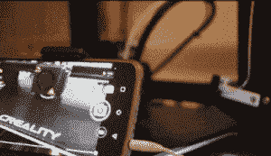

# 用旧耳机和一些备件制作 3D 打印时间流逝

> 原文：<https://hackaday.com/2022/11/30/making-3d-print-time-lapses-with-old-earphones-and-a-few-spare-parts/>

制作出色的 3D 打印延时动画的技巧是确保每次拍照时挤出机都已经移出画面——这通常需要 OctoPrint 同时控制相机和打印机。但是[NirL]设法组装了一个系统，用一个备用的限位开关、一个电阻、他的手机和一副旧耳塞得到了同样的结果。对于一些备件和一点额外的 g 代码来说还不错。

The print head hits a remote shutter button during a brief parking action after each layer.

定期插入自定义 g 代码以停放打印头，从而实现打印机运动的标准化；Cura 中甚至有一个后处理扩展，使这变得容易。至于触发相机，[NirL]的灵感来自自拍杆上的遥控快门按钮。通过放置一个物理开关，使得打印头每次(短暂地)停止时按下它，就可以为每一层拍摄一张照片。本质上和 Octolapse 做的一样，只是部件更少。

为了创建 DIY 遥控快门按钮，[NirL]使用了一个备用的限位开关，电阻器，并拆下了一套旧的耳塞，用于电缆和 4 导体 3.5 毫米音频插头。大多数手机和相机应用程序在通过音频插头接收到 Vol+信号时都会触发快门，这是通过一个 240 欧姆的电阻连接麦克风和 GND[来完成的。](https://www.codrey.com/learn/selfie-stick-little-secrets/)

通过这种方式，每一层都可以抓拍到一张照片，给[NirL]一个流畅的动画所需要的一切。当然，在打印过程中，它会占用手机，但只需几个备件，它就能完成工作。您可以在视频中看到该项目的运行情况，它就嵌入在分页符下面。

如上所述，实现轻松延时的通常方式是[使用 OctoPrint](https://hackaday.com/2018/07/02/coolest-way-to-watch-3d-printing-lights-camera-octolapse/) 的 Octolapse 插件，它创建了丝滑流畅的动画[，没有典型的延时模糊](https://hackaday.com/2018/04/13/3d-printer-time-lapse-videos-ditch-the-blur/)。

 [https://www.youtube.com/embed/4eY_UI1YXEs?version=3&rel=1&showsearch=0&showinfo=1&iv_load_policy=1&fs=1&hl=en-US&autohide=2&wmode=transparent](https://www.youtube.com/embed/4eY_UI1YXEs?version=3&rel=1&showsearch=0&showinfo=1&iv_load_policy=1&fs=1&hl=en-US&autohide=2&wmode=transparent)

