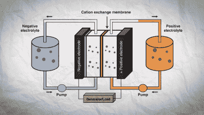
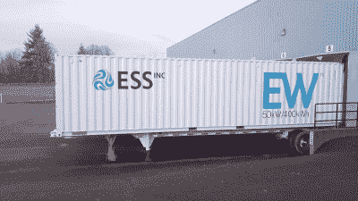
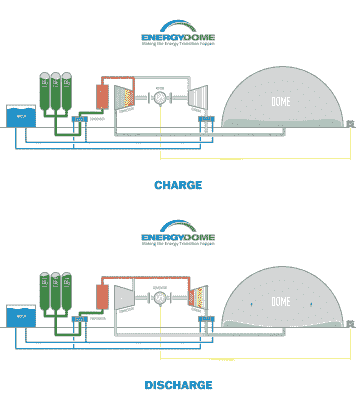

# 怪异的储能解决方案可以帮助电网走向可再生

> 原文：<https://hackaday.com/2022/11/29/weird-energy-storage-solutions-could-help-the-grid-go-renewable/>

我们都熟悉电池。无论我们谈论的是电视遥控器中的一次性 AAs，还是充满可充电电池的大型设施，它们都是我们日常生活的一部分，并且很容易理解。

然而，存储能量的新技术即将出现，用于电网存储，并且它们与我们习惯的常规电池非常不同。这些技术是充分利用太阳能和风能等可再生能源的关键，因为这些能源并不总是可用的。让我们来看看其中的一些想法，以及它们如何从根本上改变我们对“电池”的看法

## 铁液流电池

Diagram indicating the operation of an iron flow battery. Credit: [ESS, Inc, YouTube](https://www.youtube.com/watch?v=xCzKQbukL1E)

通常，我们使用的电池由金属或塑料外壳组成，里面有一些电解质，夹在电极之间。通常，电解液是糊状或凝胶状的，出于各种意图和目的，我们认为电池是典型的固体，即使它们内部是胶粘的。

铁液流电池以完全不同的方式工作。他们使用液态电解质，根据需要将电解质泵入电池来发电。电解质由溶液中的铁离子组成，通常以水溶液的形式存在，如氯化铁或硫酸铁。

典型的电极材料是正侧和负侧的碳，电池被构造成两个半电池，其间有多孔隔板。当电池充电时，铁(II)离子在正极半电池中被氧化，放出电子变成铁(III)离子。在负半电池中，铁(II)离子获得电子变成铁(0)，金属铁镀在负电极上。当电池向负载放电时，这些反应反向进行，负半电池电极上的金属返回到溶液中。

ESS has developed iron flow batteries that can fit inside shipping containers. This model can deliver 50 kW of power, and stores up to 400 kWh of energy. Credit: [ESS, Inc., YouTube](https://www.youtube.com/watch?v=xCzKQbukL1E)

铁液流电池的优点是可以规模化。可以很容易地建造更大的储罐和更大的电池，这对于希望存储许多兆瓦时能量的电网应用来说是理想的。更进一步的好处是铁液流电池的循环寿命，在 10，000 到 20，000 次循环之间测量。这比大多数锂离子电池好一个数量级，使铁液流电池的工作寿命达到 10 到 20 年，甚至更长。

所涉及的化学物质也廉价易得——铁及其盐类几乎在世界任何地方都很容易找到。对生产高端锂离子电池至关重要的昂贵稀土金属的需求很少。此外，使用的化学物质也是安全的——铁液流电池中没有任何东西会像其他技术一样爆炸或着火。

然而，铁液流电池也有一些缺点。这项技术只是没有锂离子电池的功率密度，所以需要更多的空间来建立一个能够提供相同功率的电池。此外，由于负电极上的电镀反应，铁液流电池的规模不如其他一些理论设计。其他液流电池只需要更多的电解质来保持产生能量，电极的尺寸在这方面并不重要。此外，尽管该技术以化学方式直接储存电能，但假设有合适的土地可用，铁液流电池通常仍不如[水力抽水蓄能](https://hackaday.com/2017/07/12/places-to-visit-electric-mountain/)有效。然而，先进的水力发电储存方法[可以应对这一需求](https://hackaday.com/2022/02/02/underwater-tanks-turn-energy-storage-upside-down/)。

今天，许多公司正在开发现实世界应用的技术。ESS 等公司生产的集装箱大小的液流电池的容量高达 500 千瓦时，其输出功率足以在 12 小时内为数十个家庭供电。将多个单元堆叠到单个安装中可以根据需要扩展容量。他们的目标是所谓的“长期”存储市场，用于存储 4 到 24 小时的能量。这使得它们非常适合在日常太阳能高峰期间储存能量，以便在黑夜中使用。

## **二氧化碳储存**

A diagram indicating how Energy Dome’s storage facility works in charge and discharge cycles. Credit: [Energy Dome, YouTube](https://www.youtube.com/watch?v=LXSSH6ZuOWk)

二氧化碳作为大气的主要成分，存在于我们周围。它也是一种气体，只要你把它放在足够的压力下，它在环境温度下很容易储存为液体。在这种形式下，它占据的空间要少得多，而且在相变中也能获得能量。Energy Dome 是一家认识到这种特性可能有用的公司，并开发了一种基于常见气体的存储系统。

为了给二氧化碳“电池”充电，能量被用来将气态的二氧化碳压缩成液态。压缩过程中产生的热量储存在热能储存系统中。为了提取能量，液态 CO [2] 被先前储存的热量加热，并通过涡轮膨胀，从而产生能量。该设计在一个密封系统中使用一氧化碳[2]。能量储存在施加到二氧化碳上的压力和相变中，而不是任何化学反应中。因此，本质上，它并不是真正的“电池”，比水电抽水蓄能更好，但它是一个储能系统。

该系统的优点是由简单、易于理解的现成设备构成。毕竟，压缩气体或通过涡轮机膨胀气体并没有什么激进之处。此外，不需要昂贵的稀土材料，甚至不需要大量的铜线，就像锂离子电池存储解决方案一样。

Energy Dome 已经计划到 2024 年在美国进行商业部署。它已经进行了几兆瓦规模的测试，表明了这项技术的基本原理。该公司还获得了一项协议，为意大利能源公司 A2A 建设一座发电能力为 200 兆瓦时、发电量为 20 兆瓦的设施。

## 未来的现实

事实是，随着世界各地的电网转向更多的可再生能源解决方案，储存这些能源的需求将会越来越大。像水电抽水蓄能这样的传统解决方案仍然适用，就像在世界各地突然出现的主要锂离子电池装置一样。

然而，不同的环境意味着其他存储技术也可以找到自己的位置。特别是，那些依赖廉价、易得材料的公司将拥有优势，尤其是考虑到当今面临的地缘政治和供应链问题。随着存储可再生能源成为未来电网的重要组成部分，预计更多新技术将出现在这一领域。