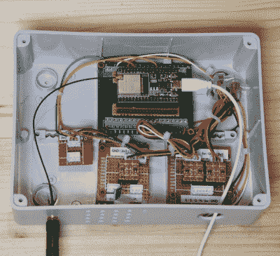

# 不管下雨还是晴天的气象站

> 原文：<https://hackaday.com/2022/11/30/a-weather-station-for-whether-it-rains-or-shines/>

【Giovanni Aggiustatutto】创建了一个 [DIY 气象站](https://www.instructables.com/DIY-Weather-Station-With-ESP32/)来测量降雨量、风向、湿度和温度。[Giovanni]一直致力于气象站的各个部分，包括[雨量计](https://www.instructables.com/DIY-Arduino-Rain-Gauge/)和[风速计](https://youtu.be/EWfUigol30M)，气象站的建设纳入了所有这些过去的项目，并添加了一些额外的功能，用于测量和访问。

对于温度和湿度，DHT22 传感器位于 3D 打印的 Stevensen 屏幕中，为传感器提供稳定的气流，同时保护模块免受阳光直射和雨水的影响。一个大部分是 3D 打印的风向标被打印出来，底部连接着一个滚珠轴承和磁铁，这样位于底部“plus”配置的四个霍尔传感器就可以检测方向。3D 打印风速计使用霍尔传感器来检测设备的转速。雨量计使用一种“翻斗”机制，附有一个磁铁，可以触发固定在框架上的霍尔传感器。雨量计(或者雨量计，如果你喜欢的话)需要额外的校准来调整水桶在倾倒前的水量。

带有附加电平转换器和 BMP180 大气压力传感器模块的 ESP32 放置在接线盒中。ESP32 用于与每个传感器通信，并允许外部互联网连接到[家庭助理](https://github.com/home-assistant/core)服务器，以将收集的数据推出。

[Giovanni]在记录每件作品方面做得非常出色，包括提供 3D STL 文件。气象站是我们最喜欢的，收集的内容和方式多种多样，从[超声波风速计](https://hackaday.com/2021/07/06/open-source-ultrasonic-anemometer/)到[太阳能气象站](https://hackaday.com/2022/09/22/hackaday-prize-2022-solar-powered-lora-weather-station-for-the-masses/)，很高兴看到【乔瓦尼】的观点。

休息后的视频！

 [https://www.youtube.com/embed/ZnDZD35Qw7E?version=3&rel=1&showsearch=0&showinfo=1&iv_load_policy=1&fs=1&hl=en-US&autohide=2&wmode=transparent](https://www.youtube.com/embed/ZnDZD35Qw7E?version=3&rel=1&showsearch=0&showinfo=1&iv_load_policy=1&fs=1&hl=en-US&autohide=2&wmode=transparent)

