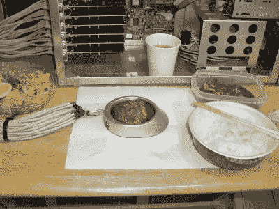

# 倒退:USB 电热板使用了 30 个端口

> 原文：<https://hackaday.com/2022/12/01/throwback-usb-hotplate-used-30-whole-ports/>

曾几何时，USB 还很时髦，很酷，也很容易理解。你可以从一个端口获得高达 500 mA 的电流，这并不多，但一些公司还是生产了 USB 保温杯，这有点像个笑话。然而，一个有进取心的黑客在 2004 年更进一步，[制造了一个强大的 USB 发热盘，由一系列端口供电。](https://akibabara.com/aho/24/)

Delicious.

令人遗憾的是，一个 USB 保温杯没能做出一个像样的煎蛋，于是这个项目诞生了。为了纠正这一点，制造了一个加强版。暖杯器去掉了原来的硬件，代之以六个 2 欧姆的电阻。在 5 伏电压下，每个将消耗 2.5 安培，总功率消耗大约为 75 瓦。因此，每个电阻将需要五个 USB 端口来供电，以保持在 500 mA 的限制之下，总共有 30 个 USB 端口。为此，在主板上安装了六个 PCI-to-USB 卡，提供必要的端口。一个 500 瓦的电源意味着电脑有足够的电力来运行电热板。

烹饪被证明是成功的，产生了相当多的热量使一些牛肉变成褐色。配上一些白米饭，这证明是一顿丰盛的饭菜，尽管明显带有电子元件的味道。

这在今天不会是一个挑战。 [USB-C 能够通过一个端口以 20 伏 5 安培的电压输出 100 瓦的功率](https://hackaday.com/2021/04/21/easy-usb%E2%80%91c-power-for-all-your-devices/)。然而，在一个运行 30 个 USB 1.1 端口的可笑的电炉上烹饪也有一些快乐和迷人的地方。这种独创性值得称赞，这确实是一个时代的项目。