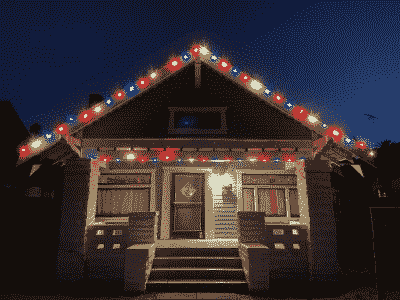

# 悬挂圣诞灯，没有梯子，没有烦恼

> 原文：<https://hackaday.com/2022/12/03/hanging-christmas-lights-with-no-ladder-and-no-fuss/>

如果不小心的话，爬上梯子去挂圣诞灯是伤害自己的一个很好的方式，冬天的天气只会增加危险。一个有进取心的黑客想出了一个完全避免梯子的巧妙方法，他把灯挂在安全的地面上。

Result!

这个建筑使用了巨大的磁铁和三角形吊环螺栓，每隔一段距离固定在圣诞灯串上。磁铁用于将灯固定在金属屋顶壁板上，而挂钩则允许使用大型可延伸杆上的挂钩将灯提升到位。垫圈、垫片和螺钉用于将磁铁和挂钩固定在灯具上。

对于遵循简单尖顶屋顶线条的布局来说，这一招非常管用。对于更复杂的安装，您可能仍然需要爬上梯子。如果你想升级你的游戏，我们已经在之前精选了关于开始使用高级圣诞灯光显示的[的很棒的入门读物。](https://hackaday.com/2017/01/09/engineers-primer-on-diy-christmas-light-shows/)

与此同时，无论你多么喜欢季节性装饰的边缘政策，都不要想着看*装饰大厅(2006)。*丹尼·德维托拯救了很多电影，但他没能拯救这个。节日快乐！