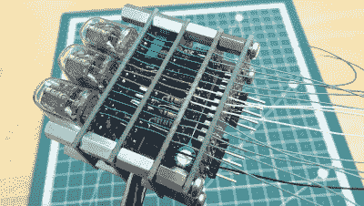

# 谢妮显示模块可通过 SPI 寻址

> 原文：<https://hackaday.com/2022/12/03/nixie-display-module-is-addressable-via-spi/>

市面上有很多 SPI 接口屏幕，但很少有像老式数码管那样的魅力。[Tony]决定开发一个简单的三谢妮模块，可以通过 SPI 寻址。

The stacked construction keeps things compact.

该模块依靠 PIC16F15344 微控制器来运行节目，使用其内置的 SPI 接口。它由四块堆叠的 PCB 组成，便于组装和测试。它使用内部降压转换器从 6 到 12 伏输入产生谢妮管所需的 170 伏电压。高压线被引向电池堆内部，以尽量减少搬运时的任何恶劣冲击，尽管谨慎仍是明智的。

驱动显示器非常简单，只需通过 SPI 接口发送 16 位字，器件在 SPI 客户端模式 1 下工作。如果您正在寻找一种简单的方法让项目将输出写入一个漂亮的谢妮显示器，这个模块可能正是您正在寻找的。或者，如果你找不到地铁，也有其他不错的解决方案。休息后的视频。

 [https://www.youtube.com/embed/JuaePomIRmI?version=3&rel=1&showsearch=0&showinfo=1&iv_load_policy=1&fs=1&hl=en-US&autohide=2&wmode=transparent](https://www.youtube.com/embed/JuaePomIRmI?version=3&rel=1&showsearch=0&showinfo=1&iv_load_policy=1&fs=1&hl=en-US&autohide=2&wmode=transparent)

