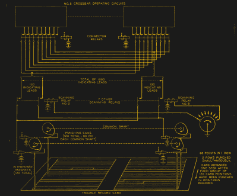

# 又是 20 世纪 50 年代打孔的痕迹

> 原文：<https://hackaday.com/2022/12/02/stack-trace-from-the-1950s-punches-again/>

这个由西雅图电话连接博物馆制作的维修/指导视频展示了一项来自 20 世纪 50 年代的令人惊叹的机电技术 5XB 故障记录器。博物馆志愿者莎拉“开关女巫”对旧电话设备有着深厚的热情，并对故障记录器、它解决的问题、它如何工作以及他们如何着手修理它进行了精彩的描述。

随着中心局交换变得越来越复杂和密集，手动查找故障的方法变得难以管理。使用故障灯的半自动方法，但即使这样也有其局限性。这个“堆栈跟踪”可能有数百个指示器，当技术人员在表格上记录状态时，它必须被冻结。如果在此期间出现了另一个故障，它就会丢失。利用当时可用的技术，解决方案是一个令人难以置信的穿孔卡设备，当检测到交换错误或各种看门狗定时器到期时，该设备会穿孔超过一千位的信息。

连接博物馆的故障记录器不太好用。但是经过大量的耐心和查阅服务手册，该团队最终让它重新运行起来。现在最大的问题是，当他们最后用完几盒空白卡片时，要印出新的空白卡片。

如果你对这些复杂的机电系统感兴趣，请观看下面的视频。我们特别喜欢这种机制，它将 1200 比特分成 10 个定时序列，每个 120 比特，使用电机、凸轮、齿轮和继电器触点来驱动打孔机。你可以在 1950 年 5 月的《贝尔实验室记录技术报告》(第 214 页)中了解更多关于这个故障记录器的信息(有趣的是，这个问题始于 Hamming 博士关于错误检测和纠错码的著名论文)。

 [https://www.youtube.com/embed/OWL_eiu6g2Y?version=3&rel=1&showsearch=0&showinfo=1&iv_load_policy=1&fs=1&hl=en-US&autohide=2&wmode=transparent](https://www.youtube.com/embed/OWL_eiu6g2Y?version=3&rel=1&showsearch=0&showinfo=1&iv_load_policy=1&fs=1&hl=en-US&autohide=2&wmode=transparent)

