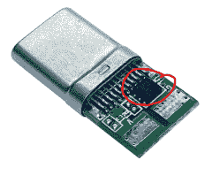
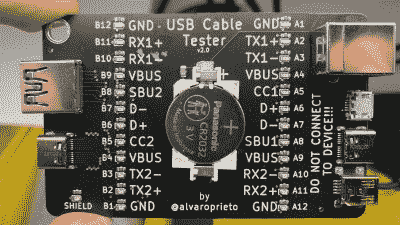
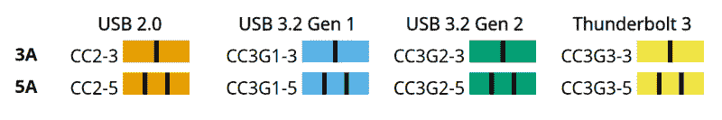
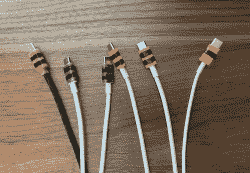
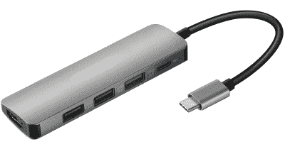

# 所有关于 USB-C:电缆类型

> 原文：<https://hackaday.com/2022/12/13/usb-c-cable-types/>

USB-C 电缆和连接器:这些都是有争议的话题，这是理所当然的——我不想手下留情。我还会告诉你，事情不一定对你那么糟糕，只要你愿意运用一些技巧，调整你的期望。

## 布线的狂野西部

您可能有一堆 USB-C 电缆，它们看起来可能完全一样，但您可能经历过它们内部不一样，并且经常看不到标签。是的，情况相当糟糕，可以说情况越来越糟。

我想澄清一下，我这里说的只是 USB C 公–USB C 公线缆。虽然 USB-A 到 USB-C 这样的电缆很受欢迎，但它们非常简单；你得到的是 USB 2.0 或 USB 3.0 的数据和最多 2 A 的电流，USB-C 插头通常硬连线为“主机，将提供五伏”，这是由上拉电阻定义的。此外，虽然像“Type-C to DisplayPort”这样的电缆乍看起来可能像电缆，但它们是带有[大量有源电路的适配器](https://www.reddit.com/user/hubsdocks/comments/pjju28/sneak_peek_of_other_usbc_dp_bidirectional_cable/)。

纯粹按照规范，曾经有六种类型的 USB-C 到 USB-C 电缆。然后，[变成了八。](https://people.kernel.org/bleung/now-how-many-usb-c-to-usb-c-cables-are-there-usb4-update-september-12)现在，恐怕有 12 根，纯粹是按照规格，如果算上所有不合规格的电缆，还会有更多。好消息是，大多数时候，这些电缆大多适合充电和数据传输等简单任务，需要特殊电缆的情况很少。不过，让我们来看一下，你会发现它们比看起来更容易区分。

## 将电缆分类放入(金属)盒中

首先，电流能力有两种变化——3 A 和 5 A，3a 是任何电缆的最低要求，5 A 支持是可选的。当然，正如你所猜测的，便宜货电缆甚至可能小于 3 A，但大多数电缆将通过 3 A 没有问题。去年，USB-C 集团推出了 EPR，将最大电压从 20 V 提高到 48 V，并要求改变电缆和连接器，以增加电源和数据引脚之间的隔离。那就多了两类，SPR(最大 20 V)和 EPR(最大 48 V)。然而，没有 3 A EPR 电缆，所以它没有听起来那么令人困惑。

那么，数据传输速度至少有四种变化。过去，只有 USB 2 和 USB 3 的 C 型电缆，以及 Thunderbolt 认证的电缆。现在，有一个新的 USB 3 标准，它需要更高的速度，并需要更高规格的电缆。此外，还有有源 USB-C 电缆，可以通过驱动器或光纤传输信号，实现远距离操作。如果您认为可能会有一些布线变化，在规范内外引入额外的小排列，那么很不幸，您是对的。

这给了我们一个“你手头可能有哪根电缆”的 3×4 矩阵。三个用于 3 A、5 A 或 EPR 5 A，四个用于电缆速度。还有很多明显不合规格的电缆——比如没有 2.0 针的充电专用电缆，这是对 USB 规范的亵渎。当然，你确实可以偶然或者故意买到这些。你怎么知道你有哪些？让我们将情况简化为三乘四的情况，并在很大程度上排除例外——随着时间的推移，奇怪的电缆将变得越来越不明显，因为即使是便宜货箱制造商也将学会将它们放在一起。

有这么多电缆变化的不可否认的好处是，当你只需要价值 5 美元的功能时，你实际上可以购买 5 美元的 USB-C 电缆，当你需要价值 40 美元的功能时，你可以购买 40 美元的电缆。2.0-电缆也更薄、更轻、更灵活——当你想在旅途中为笔记本电脑充电时，你真的不想使用 Thunderbolt 电缆。再加上 USB-C 有区分不同线缆的设施！让我展示给你看。

## 你的电缆里有一台电脑…差不多

当电源能够通过电缆提供超过 3 A 的电流时，它不会立即这样做，首先，它会检查电缆是否能够处理这样的电流，以及连接的设备是否能够接受它。

它到底是如何检查电缆性能的？通过阅读电缆的“电子标记”。电子标记器是电缆插头内的存储芯片，它对电缆性能和参数进行编码，并接入 CC 通道以传输它们。除了 USB 3 速度或 3A 电流之外，它还需要其他任何东西，并且有无数的参数可以编码到一个电子标记中，甚至包括国家代码。您想了解更多信息吗？这里有一个[可编程电子标记器(VL151)数据表，](https://datasheet.lcsc.com/lcsc/1806080019_VIA-Tech-VL151-A3-W_C209761.pdf)它列出了一吨有趣的信息，你将能够从一个普通的电子标记器！

如果你喜欢它，你可以在网上购买电子标记，并把它们放在你的电缆里——这里有[库存的 WLCSP VL151，](https://lcsc.com/product-detail/USB-ICs_VIA-Tech-VL151-A3-W_C209761.html)还有同样的目前缺货的 UDFN 版本；遗憾的是，你只能在 I2C 上空重演三次。如果你想制作自己的支持 5A 的 USB-C 电缆，你也可以购买焊接有电子标记的电缆插头。人们只能希望我们很快就能在 USB-C 电子标签上看到厄运。

## 我们自己检查电缆

所以你可以通过阅读电子标签来检查电缆的性能。Linux 用户可能认为这些信息应该已经在`/sys/`的某个地方提供给你了，但是显然，还没有太多的支持——`/sys/class/typec/`在我的 6.0.3 内核的框架笔记本电脑上是空的，即使插入了 Type-C 监视器。同时，[有 USB-C 测试仪可以读取电子标签信息。](https://www.reddit.com/r/UsbCHardware/comments/z2hncm/recently_learned_that_the_latest_generation_of/)此外，在本系列文章之后，我可能会向您展示如何自己构建一个电子标记阅读器！

如果没有电子标记，您可以假设 USB 2.0 速度和 3 A 电流支持，但不一定比这更多。除了电缆的载流能力，电子标记还可以告诉你电缆是否包含高速线对，以及是哪种高速线对。

当然，除了所需的 USB 2.0 线对之外，USB-C 电缆应该不包含高速线对，或者包含四个高速线对。法律上也有例外——如果您有一根 USB-A 到 USB-C、USB 3 电缆，它将只包含两对电缆。带有硬连线(系留)电缆的 USB-C 转 HDMI 适配器也可能只有两对。此外，在实践中，我有一个电缆来与我的 USB 到 M.2 NVMe 外壳，只有两对。它适用于 USB 3.0，但不适用于 DisplayPort 之类的设备——无论如何，它不够长。

要不要自己检查一下？谢天谢地，没必要把电缆拆开。我们已经讨论了很多 USB-C 测试器，[这里只是最近的一个。](https://hackaday.com/2022/11/20/a-handy-oshw-usb-cable-tester-for-your-toolkit/)它是开源的，你可以很容易地为自己组装；不然 Tindie 和速卖通有一大堆现成的。这不会显示 20 Gbps 和 40 Gbps 电缆之间的任何差异，但可以让您区分支持 2.0 和 3.0 的电缆。

你也可以在体内测试电缆。如果你使用 100 W 的充电器和 100 W 的笔记本电脑，你可以很容易地检查你的电缆是否有 100 W 的能力，只需通过廉价的 USB-C 功率表将它们插在一起，看看功耗是否超过 3A。如果您有一堆电缆，并且您想知道它们是否支持 USB3 或更高标准，并且您碰巧有一个带 USB3 功能的 C 型母端口的 M.2 NVMe 机箱，情况也是如此。

有鉴于此，这里有一个快速而肮脏的测试–用电缆将盘柜连接到配备 USB-C 的笔记本电脑，然后运行`lsusb -t`，它将显示连接速度(USB2 电缆为 480，USB3 电缆为 5000/10000)。此外，你还可以检查你的 USB3 电缆是否有一根没有通过可逆性测试——因为，很明显，这仍然是个问题。

## 弥补标签的缺失——我们自己

当然，制造商在制造时就知道线缆的性能和确切的内部结构。有*假定*是标签，但电缆上几乎没有标签。有时包装上有标签，所以，如果你还没有扔掉它，你可能会想记下上面写了什么——或者重新看看商店的清单。比方说，你有一根没有标记的电缆，你刚刚确定了它是哪种电缆。你是做什么的？

嗯，你把指甲油瓶子拿出来，按照[的提议[@_saljam]。](https://twitter.com/_saljam/status/1416763470247247879)这是[一种在你了解了 USB-C 电缆的功能后，用来标记 USB-C 电缆](https://sa.lj.am/usbccccc/)的颜色方案。一个条纹表示 3A，两个条纹表示 5A。橙色是 USB 2.0，蓝色是 USB 3 20 Gbps (Gen 1)，绿色是 USB3 40 Gbps (Gen 2)，黄色是 Thunderbolt。我特别喜欢这种方案，支持 Thunderbolt 5A 的电缆看起来像蜜蜂。而且，[_saljam]说这个方案对色盲相当友好！

也就是说，USB-C 开始修复东西。他们引入了一个新的标签方案，遭到了许多人的嘲笑。然而，这个新的标识方案非常简单，也很有意义。如果电缆支持 40 Gbps，它上面会有 40 Gbps 标志。如果线缆支持 240 W，上面会有 240 W 的 logo。如果它支持两者，它将有两个标志。你可能不想用指甲油涂掉这些标志，但我相信你会想出办法的。

## 囚禁中的 USB-C

你可能见过像坞站这样的设备，它们永久性地连接着短的 USB-C 电缆，而不是在坞站上有一个母端口，并使用公-公电缆。这被称为“系留电缆”。自持电缆实际上不属于相同的规则，它们所需的电路更简单，这就是为什么它们经常被用在便宜的东西上。

简而言之，如果您想在设备上使用高速通道，并在其中内置一根自持电缆，则无需添加高速多路复用器芯片来支持两种不同的电缆旋转——这样，主机就有责任适应自持电缆的方向。此外，由于唯一可能的 CC 线路是硬连线的，您只需要一个 5.1kω电阻，而不是两个，并且您也不需要电子标记器。另一方面，如果您要将一个带有高速通道的母端口添加到您的 dock，您确实需要一个多路复用器。

在速卖通上以 15 美元的价格出售一个功能强大的 USB-C 基座，这是一个非常省钱的安排，但这是不行的。因此，许多便宜的设备将会带有系留电缆，这使得事情变得既容易又困难。从好的方面来说，您不再需要担心选择正确的电缆来连接这样的设备，而且它更有可能以一种有用的方式符合标准，因为实现受控电缆非常简单。不利的一面是，你受限于焊接到设备中的电缆，如果电缆断裂，整个设备都会断裂。还有，你不能完全延长它。还是可以？

下一次让我们来讨论扩展，以及其他类型的 USB-C 电缆，这些电缆可能符合规范，也可能不符合规范。现在，有一点要记住——电缆应该易于更换。如果一根电缆不再是你的朋友，或者它变得很奇怪——在它上面贴上一个耻辱的标记，把它放在一个你不会想用它的地方，然后订购一根替换的；更好的是，一些替代品。就像 MicroUSB 电缆一样，更换它们是消除大多数电缆问题的主要方法。