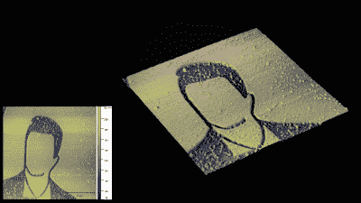

# 用电子束在硅上画出微小的形状

> 原文：<https://hackaday.com/2022/12/05/using-electron-beams-to-draw-tiny-shapes-onto-silicon/>

在过去的几年里，我们看到了几个令人印象深刻的项目，人们试图使用业余工具制造集成电路。这一过程中最复杂的部分之一是光刻:在硅片上绘制图形的步骤。有几种方法可以做到这一点，它们都相当复杂，但“打破水龙头”的[Zachary Tong]已经设法使其中一种工作得相当好。他在最新的视频中分享了他的电子束光刻实验的结果。

在电子束光刻或 EBL 中，使用真空室中的电子束在晶片上绘制图形。与大规模生产中使用的光学光刻相比，这是一个缓慢的过程，但它相当简单且非常灵活。[扎克]决定用他的电子显微镜作为电子束石版机；虽然不是为平版印刷设计的，但它与真正的 EBL 机器有着相同的基本组件，只要稍微调整一下软件，它就可以充当替代品。

 

【扎克】也有一台原子力显微镜，他用它来制作这些美丽的图像。

第一步是在晶圆上涂上一层电子束抗蚀剂。[Zach]使用 PMMA，通常称为丙烯酸塑料，并在将其溶解在茴香醚中后使用旋涂法涂覆。然后，他将晶片放入电子显微镜，用它来扫描图像。然后通过在冷的异丙醇中冲洗晶片来显影图像。

[Zach]在他的视频中详细解释了整个过程，包括他如何调整所有参数，如抗蚀剂厚度、光束强度、曝光时间和显影时间，以及说服显微镜充当平版印刷机所需的软件技巧。在他最好的一次实验中，他成功地画出了宽度约为 100 纳米的线条，对于这样一个相对简单的装置来说，这是非常令人印象深刻的。

这些电子束光刻实验延续了[【扎克】早期使用激光的研究](https://hackaday.com/2022/03/22/old-printer-becomes-direct-laser-lithography-machine/)。自制集成电路专家萨姆·泽洛夫也在他的工作中使用了电子束。感谢提示，[smellsofbikes]！

 [https://www.youtube.com/embed/3KXkcFcjcfY?version=3&rel=1&showsearch=0&showinfo=1&iv_load_policy=1&fs=1&hl=en-US&autohide=2&wmode=transparent](https://www.youtube.com/embed/3KXkcFcjcfY?version=3&rel=1&showsearch=0&showinfo=1&iv_load_policy=1&fs=1&hl=en-US&autohide=2&wmode=transparent)

