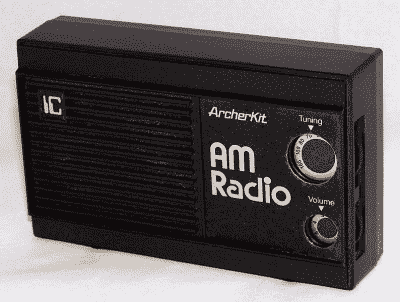
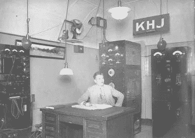

# 问 Hackaday:你 2030 年的汽车会有 AM 收音机吗？

> 原文：<https://hackaday.com/2022/12/09/ask-hackaday-will-your-2030-car-have-am-radio/>

汽车制造商逐步淘汰汽车上的调幅收音机已经有一段时间了。让我们面对现实吧，现在 AM 上没有多少，电动汽车对 AM 收音机造成干扰也是众所周知的。那么为什么要有它们呢？就此而言，许多售后市场的主机现在甚至根本没有收音机。他们播放数字媒体或从你的手机蓝牙流。然而，美国参议员爱德华·j·马基已经开始给主要汽车制造商写信，敦促他们在未来的汽车中保留调幅收音机。

那是不是意味着我还活着？还是汽车制造商会扼杀它？这封信要求这些公司回答几个问题，包括他们是否计划在不久的将来停止 AM 或 FM 广播，以及他们是否支持数字广播电台。

 

调幅广播套件-[CC-BY-SA-2.0](https://creativecommons.org/licenses/by-sa/2.0/deed.en)BY[Joe Haupt]

我们必须承认，我们很怀念拥有大众感兴趣的节目的稳健的调幅广播电台。能够制造简单的收音机并听到你喜欢听的东西是令人兴奋的。此外，在晚上收听遥远的电台也很有趣，因为广播经常会把遥远的城市甚至国家传到你的收音机里。但如今，调幅波段大多是一些政治、宗教或非英语节目的边缘广播公司，没有支持调频电台的听众基础。在你匆忙发表评论提供你最喜欢的反例之前，当然，还有一些更一般的广播和一些调频翻译。也有一些微型广播站服务于有限的地区。但是大功率、大众感兴趣的调幅广播电台的日子已经一去不复返了。

## 谎言和统计数据

这封信似乎将调幅和调频广播混为一谈，说“调幅广播长期以来一直是消费者的一个重要信息来源……”接下来是，“在新冠肺炎·疫情之前，近 90%的美国人……每周收听调幅或调频广播……”我们猜测这 90%中的绝大部分是收听调频广播。然而，我们惊讶地得知，一项民意调查显示，33%的消费者认为 AM 收音机是汽车中“非常重要”的功能。它还声称，FEMA 已经投资于 AM 广播电台的应急基础设施，使它们对应急管理计划至关重要，尽管所有引用 FEMA 和其他数据似乎都暗示 FM 广播也很重要。

为什么汽车制造商会在意？成本可能是一个因素。但是，更紧迫的是干扰问题。这位参议员指出，数字音频不太容易受到 EV 干扰，但是——当然——在 AM 无线电波段上几乎没有数字无线电接收器和电台。

## 我们的观点

Radio Station KHJ in 1927 – Public Domain

甚至现代收音机(包括 FM)的发明者也认为同时支持 AM 和 FM 只是权宜之计，直到 FM 取而代之。虽然我们知道可能有一小部分人依赖调幅广播并拥有一辆新车，但如果这个数字如此之大，我们会感到惊讶。然后减去在车里或单独有调频收音机的人数，如果需要的话，他们可以使用调频收音机。那么这个数字可能小得几乎为零。

更重要的是，这些人更不可能拥有数字广播接收器。你可能会说数字电台也在模拟广播。但请记住，FCC 早在 2020 年就批准了 AM 的全数字化。毕竟，扩展的 AM 波段本应重新安置数百个电台，但缺乏接收器意味着缺乏兴趣，因此扩展波段中的实际电台数量微乎其微，特别是如果你算上同时在扩展波段和传统波段中广播的电台。AM 立体声的推广也失败了，高清收音机似乎还在苟延残喘。

调幅信号的确与[民防](https://hackaday.com/2017/10/12/retrotechtacular-radio-to-listen-to-when-you-duck-and-cover/)有着悠久的历史。但令人难以置信的是，调幅广播对 2022 年的国家利益至关重要。如果我的经验是典型的，人们几乎不再使用调频，选择卫星或通过移动网络在线流媒体。当然，调幅广播游说团可能不同意。你怎么想呢?请在评论中告诉我们。

专题图片:Doc Searls(！)