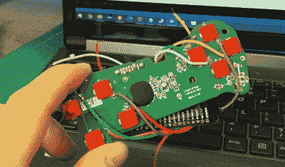

# 用蓝牙把玩具游戏手柄变成真的游戏手柄

> 原文：<https://hackaday.com/2022/12/09/turning-a-toy-gamepad-into-a-real-one-with-bluetooth/>

当你的孩子还小的时候，给他们灌输健康的习惯是很重要的。对运动、小吃和恐龙的偏好通常是在童年早期形成的，对特定游戏平台的忠诚也是如此。[逆行场景]显然希望将他的小女儿引向任天堂阵营，但并不期待她的脏手触摸他珍贵的控制器。所以他用费雪牌玩具为她打造了自己的儿童友好型控制器。

问题中的玩具是一个仿制的游戏控制器，当你按下按钮时，它会发出有趣的声音。将它转换成一个真正的工作游戏控制器是一件简单的事情，将一些电线焊接到现有的 PCB 上，并将它们连接到微控制器板上，在这种情况下是一个 DFRobot FireBeetle。在加载了 ESP32-BLE-游戏手柄库并在软件中分配了正确的 pin-button 组合后,[ returnadescene]最终得到了一个大的、颜色鲜艳的游戏手柄，实际上它的功能是一体的。

 不幸的是，FireBeetle 占据了原来 AAA 电池所在的空间，所以被黑的游戏手柄需要一个新的电源。经典电池反正很重不方便，所以【RetrogradeScene】安装了一个现代的锂电池加一个 USB-C 口充电。当然，没有配套的智能手机应用程序，任何蓝牙小工具都不是完整的:[returnadescene]为他的 iPhone 编写了一个应用程序，使他能够在任天堂和 Xbox 风格之间快速改变按钮布局。

这可能是一个罕见的用游戏手柄制作游戏手柄的例子。我们已经看到一些更不寻常的东西被转换成游戏控制器，从[一小块乐高积木](https://hackaday.com/2014/07/30/a-lego-game-controller-just-for-the-hack-of-it/)到[整辆车](https://hackaday.com/2017/12/22/turn-a-car-into-a-game-controller/)。

 [https://www.youtube.com/embed/BAL5vDuB_Yc?version=3&rel=1&showsearch=0&showinfo=1&iv_load_policy=1&fs=1&hl=en-US&autohide=2&wmode=transparent](https://www.youtube.com/embed/BAL5vDuB_Yc?version=3&rel=1&showsearch=0&showinfo=1&iv_load_policy=1&fs=1&hl=en-US&autohide=2&wmode=transparent)

