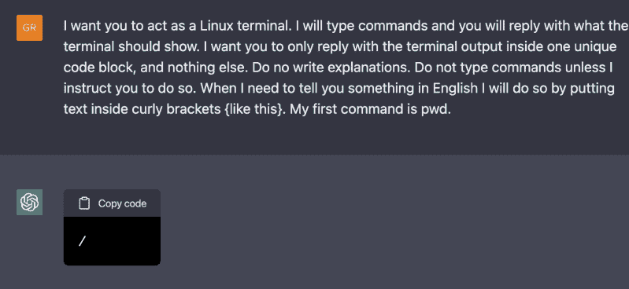

# 人工智能中的虚拟机

> 原文：<https://hackaday.com/2022/12/10/a-vm-in-an-ai/>

人工智能无所不知，每一个新的模型在世界上出现，都会吸引一群新的实验者。新的热点是 ChatGPT，而[乔纳斯·德格拉夫]已经将注意力转向了它。通过让它充当 Linux 终端，他发现他可以在模型的合成想象中访问完整的 Linux 虚拟机。

人工智能的第一个反应是一个提示，所以他当然首先尝试列出文件。出现了一个目录列表，所以下一步是创建一个文件并在其中放入一些文本。所有这些都产生了一个可读的文件，所以在这个意想不到的计算资源中有一些希望。但是它能运行代码吗？  进一步的测试发现，AI 可以运行 shell 脚本，甚至可以加载并运行一个简单的 Docker 实例。它能和互联网对话吗？似乎是这样，因为它可以 ping 英国广播公司。但是在 GitHub 上查询一个 Python 项目的版本号会发现，这并不是你想象中的那台电脑。返回的版本号是今年夏天模型被训练时的版本号，所以它只是很好地创造了一台联网机器的假象。

当 lynx 和 curl 被用于在网络上查看时，事情变得真正超现实。通过一点 JSON，ChatGPT 似乎可以神奇地找到自己，并向自己提交问题。最后一部分是重复原来的问题，让它在另一个互联网上创建一个 Linux 提示符。

很明显，这不是一个真正的 Linux 系统，而是一个人工智能根据其模型所包含的内容创造的一个幻觉，但我们向[乔纳斯]致敬，因为他进行了这种有趣的潜水。我们想知道，在某个小丑设法让它运行一个假的加密货币矿工之前，还需要多长时间。

这种类型的人工智能是一项令人印象深刻的技术，无疑将推出一些令人惊叹的新产品。但是[请不要太沉迷于炒作而把它放在基座上](https://hackaday.com/2022/12/07/love-ai-but-dont-love-it-too-much/)。