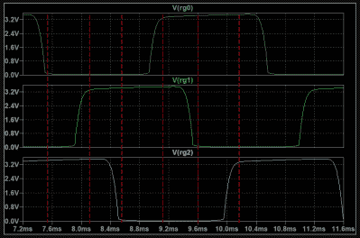

# 基于 NE555 的电子骰子

> 原文：<https://hackaday.com/2022/12/11/ne555-based-electronic-dice/>

在 Hackaday 社区中，建议一个项目可以或者应该使用 555 定时器来完成已经成为一个笑话。[Tim]在他最新的电子骰子项目中相当重视这一点，该项目使用了三种古老的设备。

如果用三个 555 制造一个电子骰子看起来太多了，那么值得考虑的是，上次我们分享他的项目时，他用了 22 个！从那以后，[Tim]一直忙于优化他的设计，同时保持在老式通孔焊接套件的限制范围内。

也许这个项目最令人惊讶的是 NE555 设备的用途。与其说它们具有著名的振荡特性，不如说它们实际上只是被用作施密特触发器，以清理由分立晶体管和无源器件构成的三相环形振荡器。

Simulation trace of the three-phase ring oscillator before Scmitt Trigger stages

环形振荡器巧妙地产生三个相移方波，这样三个相位的二进制组合提供了六种独特的状态。六是掷骰子的完美数字，接下来要做的就是找出哪个 led 需要在哪个状态下打开，并相应地连接它们。

要“掷骰子”,一个按钮启动振荡器，当它被释放时再次停止，在 led 上显示随机的结束状态。

看看使用旧技术能做些什么可能会很有趣，尝试将设计优化到尽可能少的部件也会很有教育意义。

[【Tim】的早期项目在这里](https://hackaday.com/2022/01/08/555-timer-on-its-own-in-electronic-dice/)如果你想看看设计是如何发展的。关于这两个迭代的文档都非常优秀，值得一读。

 [https://www.youtube.com/embed/87U51SCs45A?version=3&rel=1&showsearch=0&showinfo=1&iv_load_policy=1&fs=1&hl=en-US&autohide=2&wmode=transparent](https://www.youtube.com/embed/87U51SCs45A?version=3&rel=1&showsearch=0&showinfo=1&iv_load_policy=1&fs=1&hl=en-US&autohide=2&wmode=transparent)

