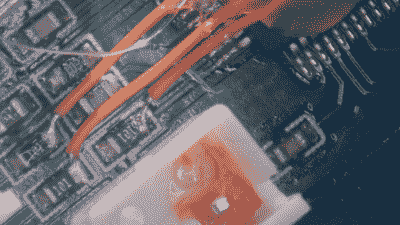

# 激光投影仪需要软件修改后的硬件破解

> 原文：<https://hackaday.com/2022/12/11/laser-projector-needs-hardware-hack-after-software-mod/>

当你在更新固件后重启一个小工具时，你可能会意识到那种可怕的感觉，迎接你的只是一个空白的屏幕和一个没有反应的设备。这显然发生在[的前主人身上，一台砖砌的 RGB 激光投影仪[Buy It Fix It]得到了他的手:它在通电时短暂闪烁激光，但在其他情况下完全熄灭。](https://www.youtube.com/watch?v=pPd5vDxhMG8)

对主要组件的彻底检查没有发现任何物理损坏，所以问题一定出在软件上。[Buy It Fix It]设法将他的 Segger J-link 编程器连接到 STM32 主处理器，并下载了其固件的内容，却发现了一个 PDF 文件的残余，该文件似乎被意外地闪入了芯片的程序空间。修复设备应该只是恢复正确的固件，但[购买修复]无法在任何地方找到它的副本。

 他找到的是 [Maximus64 的 GitHub 库](https://github.com/maximus64/sd_rgb500_cfw)，里面有一个不同投影仪型号的软件模块，以及它的原始固件。刷新那个版本也没有修复[购买它修复它]的投影仪，尽管它现在开始启动它的 galvos。

一点逆向工程显示，从硬件角度来看，这两台投影仪非常相似，但它们的激光驱动器连接到不同的 I/O 引脚:只需切割电路板迹线并焊接一些电线来重新路由信号，就足以使投影仪恢复工作状态。

不得不修改硬件以适应一个软件是不幸的，但有时你不得不用你现有的东西来凑合。如果你一开始就没有固件，那么你甚至可能不得不[从头开始写自己的固件](https://hackaday.com/2020/07/05/reviving-a-doa-smart-bulb-with-custom-firmware-for-its-esp8266/)。

 [https://www.youtube.com/embed/pPd5vDxhMG8?version=3&rel=1&showsearch=0&showinfo=1&iv_load_policy=1&fs=1&hl=en-US&autohide=2&wmode=transparent](https://www.youtube.com/embed/pPd5vDxhMG8?version=3&rel=1&showsearch=0&showinfo=1&iv_load_policy=1&fs=1&hl=en-US&autohide=2&wmode=transparent)

