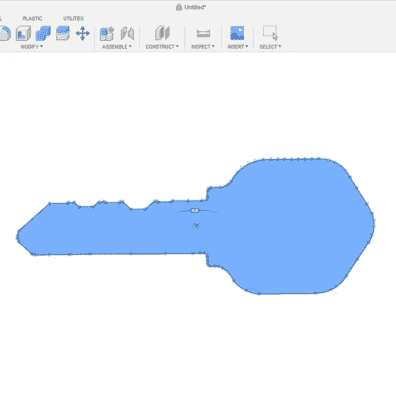

# DIY Comparatron 帮助追踪微小复杂的物体

> 原文：<https://hackaday.com/2022/12/11/diy-comparatron-helps-trace-tiny-complex-objects/>

黑客经常发现他们自己在对现有的硬件和设备进行逆向工程或接口，当接口需要是物理接口时，能够进行精确的测量确实是值得的。

当一个物体足够大，可以放入卡尺，或者至少足够直，可以放在尺子上时，这很容易做到。但是当事物是复杂的形状，或者特别小的时候，人们会怎么做呢？这就是[Cameron]的[DIY 数字光学比较仪的用武之地](https://cameroncoward.com/comparatron-diy-digital-optical-comparator)，不像商业设备，它完全在一个聪明的黑客的能力(和预算)之内。

Comparatron 基于数控笔式绘图仪，但它没有笔，而是在 3D 打印夹具的帮助下连接了 USB 显微镜。作为背景的是一个 LED 照明的面板，这种面板有助于追踪。[物理构建说明在这里](https://www.instructables.com/Comparatron-an-Affordable-Digital-Optical-Comparat/)，但图像应该给大多数机械思维的人一个非常清晰的概念，它是如何组合在一起的。

    

那么它是如何工作的呢？一个人将待测物体放在照亮的床上，软件显示一个实时显微镜视图，视频中间有一个微小的十字准线。通过来回移动显微镜(该平台能够以 0.1 毫米的增量移动)，人们可以在物体上直观地标记一系列点，创建一种点云。

因为这些点之间的距离是通过以已知的真实世界的量物理移动显微镜来记录的，所以产生的“点云”准确地反映了实际物体上的真实世界的点。从那里，一个简单的出口作为一个 DXF，然后输入到自己选择的 CAD 软件。最后一步本质上是连接这些点。这需要操作员的耐心，但它的精确度很高，价格也很合理。

3D 打印机的普及有助于业余爱好者以低廉的价格购买 CNC 硬件，并且它们的精度使其成为测量小距离项目的有吸引力的基础。你可以在下面的视频中看到【卡梅隆】的*比较器*在工作。

 [https://www.youtube.com/embed/9CRdngo2uUE?version=3&rel=1&showsearch=0&showinfo=1&iv_load_policy=1&fs=1&hl=en-US&autohide=2&wmode=transparent](https://www.youtube.com/embed/9CRdngo2uUE?version=3&rel=1&showsearch=0&showinfo=1&iv_load_policy=1&fs=1&hl=en-US&autohide=2&wmode=transparent)

