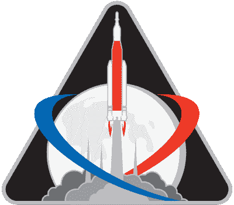
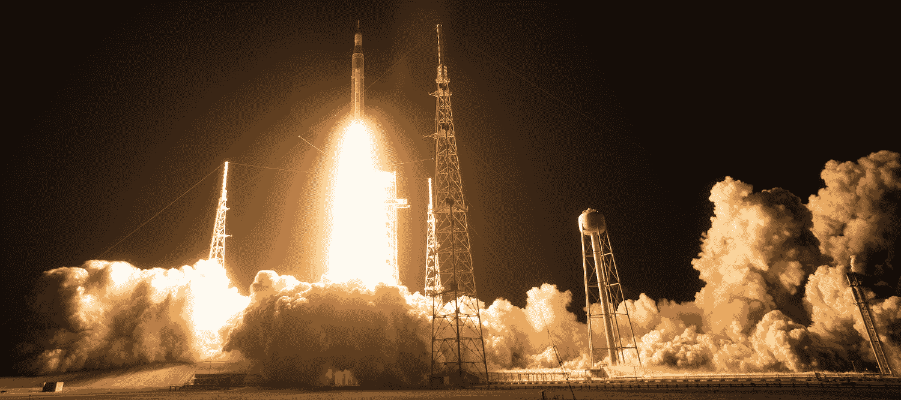
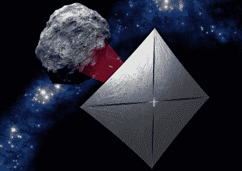
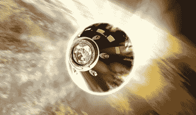

# 美国宇航局 Aces 阿尔忒弥斯一号，但旅程才刚刚开始

> 原文：<https://hackaday.com/2022/12/12/nasa-aces-artemis-i-but-the-journey-has-just-begun/>

当美国国家航空航天局的猎户座太空舱昨天下午溅落在太平洋时，它标志着几十年前开始的旅程的结束。猎户座太空舱的起源可以追溯到 21 世纪初洛克希德·马丁公司的一项提议，将它送上历史性的绕月之旅的高耸的太空发射系统火箭的开发可以追溯到 2011 年——尽管当时很少有人能想到它最终会被用来做什么。多年来，这种令人难以置信的强大航天飞机衍生火箭的预期任务发生了多次变化，有一段时间它被称为“无处可去的火箭”，因为它似乎无法决定他们想把旗舰探索飞行器送到哪里。

 但是今天，也许是第一次，SLS 和猎户座的未来似乎一片光明。阿尔特弥斯 1 号任务不仅仅是一次技术上的成功，从你愿意使用的几乎每一个指标来看，它也是一次公共关系的恩惠，这是美国宇航局在其火星探测器戏剧性着陆之外很少看到的。数千万人观看了无人驾驶任务向月球发射，这是全球兴奋的前奏，将围绕目前计划在 2024 年进行的载人后续飞行。

正如美国宇航局的评论员在近 26 天的绕月任务的直播片段中提醒观众的那样，这次试飞正式迎来了航天局所谓的 *Artemis 一代*，这是一个月球探索的新时代，继承了阿波罗的遗志。阿耳忒弥斯不是偶尔匆匆造访其美丽的荒凉之地，而是旨在为人类在我们这颗天然卫星上的永久存在奠定基础。

随着 Artemis I 的成功结束，NASA 现在已经有效地展示了让人类重返月球表面所需的三分之二的硬件和技术:SLS 证明了它有能力将沉重的有效载荷发送到低地球轨道以外，而猎户座绕着我们最近的天体邻居进行的长时间飞行确保了它能够胜任在更短更直接的路线上运送人类探险家的任务。

但是当然，期望如此复杂的飞行器的首次飞行一帆风顺是不合理的。虽然主要的任务目标都已完成，并且架构总体上达到或超过了发射前的预期，但在 NASA 为 Artemis II 做好准备之前，仍有大量的工作要做。

## 驯服 SLS

SLS 背后的想法是使用航天飞机上经过飞行验证的硬件，即 RS-25 发动机和固体火箭助推器(SRB)，作为一种节省时间和成本的措施。不幸的是，就像航天飞机本身快速重复使用的梦想一样，现实情况最终要复杂得多。虽然 SLS 发动机和助推器最初是作为航天飞机的部件出现的，但它们的最终形式是如此不同，以至于需要多年的测试和研究才能确保对传统硬件进行的大量修改能够如预期那样工作。

这些延迟一直延续到发射本身，由于技术问题，发射被推迟了几次。特别值得注意的是将推进剂装载到飞行器上时遇到的困难，从大量泄漏到阀门堵塞。这些延迟变得越来越令人担忧，因为火箭的一些组件只能在一定时间内保持可用。如果火箭没有在年底前发射，一些关键部件将不得不被拆除，检查，并可能被替换——进一步推迟任务。

Artemis I clears the tower. Photo Credit: [NASA/Joel Kowsky](https://www.flickr.com/photos/nasahqphoto/52507883571/in/album-72177720297400430/)

最终，在往返于发射台几次后，问题得到了解决，SLS 于东部时间 11 月 16 日 1:37 从 39B 发射中心呼啸着升空。所有人都认为这次发射是壮观的，因为世界上最强大的操作火箭在佛罗里达海岸短暂地将黑夜变成了白天。

当然，这种新火箭设计的初期问题并不出人意料，在这次发射中获得的知识肯定会有助于简化 Artemis II 期间的地面操作。但这些并不是地面团队遇到的唯一问题——事实证明，SLS 的废气对发射台造成了相当大的损害，包括炸毁了工作人员电梯的门。

幸运的是，有足够的时间进行修理。另一架 SLS 至少要一年半后才能从 39B 综合大楼起飞，到那时他们很可能已经找到了加固发射台受损最严重部分的方法。重要的是，经常被指责的巨型火箭表现完美，与美国宇航局的预测相比[偏差不到 0.3%。](https://gizmodo.com/sls-launch-pad-damage-nasa-1849812062)

## 受阻的搭便车者

[正如我们之前报道的](https://hackaday.com/2022/08/22/unpacking-the-stowaway-science-aboard-artemis-i/)，十个立方体卫星被包装在连接临时低温推进级(ICPS)和猎户座太空舱的级适配器内。当密封舱移动到安全距离后，这些独立的航天器被自动分配，这样它们就可以继续执行自己的任务。至少，这是我的想法。

立方体卫星相对脆弱的性质，以及其中一些卫星一旦安装在火箭上就无法为电池充电的事实，使得所有飞行器都不可能幸存下来。在撰写本文时，Artemis I 上打包的 10 颗立方体卫星中有 7 颗正在运行，不幸的是，一些最雄心勃勃的任务也在伤亡之列。

NEA Scout with solar sail deployed

日本的 OMOTENASHI 旨在展示以极低成本在月球表面降落小型科学有效载荷的能力，但在它与 ICPS 分离后，任务控制人员无法与该飞行器建立稳定的通信。

据信，立方体卫星未能正确定向其太阳能电池板，因此无法给电池充电。如果是这种情况，当它穿越深空时，可能还有机会在以后与飞船重新建立联系，但登月的窗口已经过去了。

美国宇航局自己的近地小行星探测器(NEA 探测器)可悲地彻底失败了，因为地面控制人员从未能与该飞行器建立通信。一个紧急信号被传输，这应该触发立方体卫星的 85 米 ² (910 平方英尺)太阳帆的展开，但望远镜观察证实它从未展开。据报道，地面控制人员已经失去了与研究太阳粒子的[立方体卫星(CuSP)](https://blogs.nasa.gov/sunspot/2022/12/08/artemis-i-payload-cusp-cubesat-mission-update/) 和迈尔斯团队飞船的联系。

***更新:**截至 12 月 9 日，地面站已经[接收到来自 Miles CubeSat](https://twitter.com/MilesSpace/status/1601424119085805568) 团队的信号。*

虽然这些任务的失败令人失望，但幸存的航天器，如意大利航天局的 ArgoMoon demonstrator，日本的 EQUULEUS 和美国宇航局的 BioSentinel 有望在未来几个月提供令人着迷的数据。

## 猎户座的火之审判

由于猎户座太空舱已经在 2014 年成功进行了演示飞行，作为探索飞行测试-1 的一部分，美国宇航局已经对他们最新的载人飞船的能力相当有信心。但是这个系统还有一个组件没有完全通过测试:隔热板。

 在 2014 年的轨道测试中，猎户座以大约 8.9 公里/秒(2 万英里/小时)的速度重返地球大气层，这导致隔热板暴露在高达 2200 摄氏度(4000 华氏度)的温度下。但是当阿尔特弥斯 1 号从更高的轨道返回时，再入速度显著增加。这一次，太空舱底部的烧蚀材料被称为 Avcoat，在以 11.2 公里/秒(25，000 英里/小时)的速度撞击大气层时被加热到 2800 摄氏度(5000 华氏度)。

此外， [NASA 还利用 Artemis I 在进入](https://www.nasa.gov/feature/orion-spacecraft-to-test-new-entry-technique-on-artemis-i-mission)期间测试了一种新的“跳跃机动”。这种方法不是像航天飞机那样简单地穿过大气层，而是看到太空舱在第二次重返大气层之前，从高层大气中反弹回来，以降低其初始速度。这种方法的优点是，它不仅降低了机组人员承受的重力，而且在溅落过程中允许更高的精确度。阿耳特弥斯号船员将在比他们的阿波罗号前辈更靠近美国海岸的地方结束他们的任务，这将允许更快速的回收行动。

## 钻研数据

显然，猎户座太空舱绕月飞行并安全返回地球的事实意味着阿尔特弥斯一号任务总体上是成功的。但是，在工程师真正了解汽车的性能以及可以改进的地方之前，仍然有大量的数据需要分析。也有来自飞船上科学实验的数据，例如坐在指挥官座位上的[满载传感器的人体模型](https://www.nasa.gov/feature/purposeful-passenger-artemis-i-manikin-helps-prepare-for-moon-missions-with-crew)，到目前为止，美国宇航局尚未对此发表评论。随着我们从阿波罗的快速访问过渡到后来阿尔特弥斯任务的长期停留，关于深空环境如何影响人体的信息将变得至关重要。

因此，虽然今天美国国家航空航天局的人们可能正在享受他们应得的休息，以庆祝猎户座的回归和第一次官方阿耳忒弥斯任务的完成，但他们的工作还远远没有结束。预计在 2023 年将会看到许多公告和报告发布，因为工程团队将理解在这次前所未有的深空飞行中收集的万亿字节的信息。我们对阿耳忒弥斯一代的承诺感到兴奋，迫不及待地想看到地平线上有什么发现。