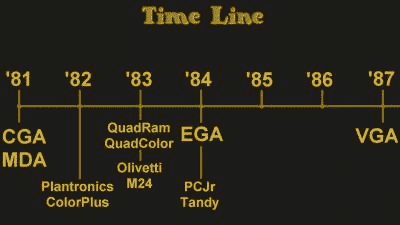

# 20 世纪 80 年代的 CGA 竞争者

> 原文：<https://hackaday.com/2022/12/12/cga-competitors-from-the-1980s/>

[大卫·穆雷]，又名 8 位家伙，[做了一个有趣的视频](https://www.youtube.com/watch?v=xNsK_F4JlG4)(嵌入在休息下)关于从 CGA 到 EGA 的 PC 显卡的时间线。他不仅解释了当天不同的祭品，而且还展示了其中的大部分。

 了解这些卡中基本上没有使用的一些视频模式很有意思。即使电路板设计者包括高分辨率模式和更好的调色板，如果软件程序员不使用它们，他们就会被遗忘。

他举的几个例子给我们留下了特别深刻的印象，这些例子是全尺寸的双层 ISA 卡——它们太棒了。当 20 世纪 90 年代到来时，CGA 和 EGA 都有点衰落了。

根据[David]的研究，即使在引入 EGA 之后，CGA 监护仪还会继续使用一段时间——主要是因为成本问题。获得一张 ATI EGA 惊奇卡可能要花 400 美元，而获得一台 EGA 显示器可能要花更多。许多人只是先升级了卡，并利用了 EGA 奇迹可以驱动 CGA 显示器的事实。

如果你对这些老卡的历史和技术感兴趣，请查看我们从 2016 年开始的报道，其中【大卫】深入探讨了 CGA 卡，并讨论了 CGA 复合视频模式等问题。

 [https://www.youtube.com/embed/xNsK_F4JlG4?version=3&rel=1&showsearch=0&showinfo=1&iv_load_policy=1&fs=1&hl=en-US&autohide=2&wmode=transparent](https://www.youtube.com/embed/xNsK_F4JlG4?version=3&rel=1&showsearch=0&showinfo=1&iv_load_policy=1&fs=1&hl=en-US&autohide=2&wmode=transparent)

