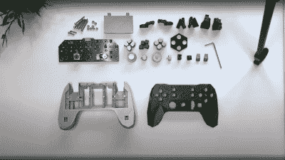

# Alpakka:一个创作共用游戏控制器

> 原文：<https://hackaday.com/2022/12/22/alpakka-a-creative-commons-game-controller/>

Input Labs 的任务是生产~~开源~~创作共用硬件和软件，用于创建可以适用于任何人的游戏控制器。 [Alpakka 是他们目前采用的通用控制器](https://inputlabs.io/alpakka) ，看起来类似于现代的 Xbox 或 PlayStation 控制器，但有很多不同之处。3D 打印的外壳具有低多边形数、棱角分明的感觉，但如果你不喜欢，你可以在 blender 中调整它，直到你想要它的样子。Alpakka 并行模拟了一个标准的 USB 连接键盘、鼠标和 Xinput 游戏手柄，因此应该可以在 Linux 和 Windows PC 平台上开箱即用。固件包括一些内置的游戏配置文件，可以在控制器上选择。

No special parts here, just 3D prints, a PCB and some nuts and bolts

用模拟棒增强的双 pad 并不罕见，但有点特别的是创造性的双陀螺仪传感器排列——当与触摸感应垫结合使用时——模拟鼠标输入。把你的拇指放在右边的方向键上，鼠标会移动，否则它会保持不动，就像把鼠标从方向键上抬起来重新定位一样。

仅有线控制器基于 Raspberry Pi Pico，它有大量资源用于这种类型的应用，提供 250 Hz 的快速更新速率。但是要处理不少于 19 个按钮输入，以及滚轮、方向开关和模拟棒，Pico 没有足够的 I/O，需要一对恩智浦 PCAL6416A I2C IO 扩展器来处理。

[PCB 设计](https://github.com/inputlabs/alpakka_pcb) 使用 KiCAD 完成，使用简单的 3D 印刷支架在焊接时将 PCB 和通孔元件固定到位。除了一些对某些人来说可能是个问题的 QFN 封装之外，手工焊接这种设计没有什么棘手的。

自从我们入侵以来，我们一直在看到定制的游戏控制器， [这里有一个有趣的鼠标集成主题](https://hackaday.com/2020/12/15/mouse-controller-hybrid-aims-to-dominate-in-first-person-shooters/) 。如果你喜欢硬件方面的东西，但固件是一个症结，那么也许只需要看看这个整洁的 RP2040 固件项目 。

 [https://www.youtube.com/embed/yYwrVL2b9eM?version=3&rel=1&showsearch=0&showinfo=1&iv_load_policy=1&fs=1&hl=en-US&autohide=2&wmode=transparent](https://www.youtube.com/embed/yYwrVL2b9eM?version=3&rel=1&showsearch=0&showinfo=1&iv_load_policy=1&fs=1&hl=en-US&autohide=2&wmode=transparent)

感谢[aamott]的提示！