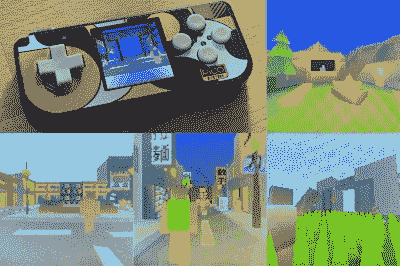

# 开放世界 3D 游戏在 RP2040 微控制器上运行

> 原文：<https://hackaday.com/2022/12/13/open-world-3d-game-runs-on-the-rp2040-microcontroller/>

Raspberry Pi RP2040 功能多样，价格低廉，但它绝不是世界上最强大的微控制器。不管怎样，它有能力做伟大的事情，正如[伯恩哈德·施特罗布尔]所展示的，他构建了一个运行在那个平台上的 3D 开放世界游戏引擎。

The graphics are simple, but with a compelling low-poly style.

游戏引擎本身是为了在 Pimoroni PicoSystem 上运行而构建的，Pimoroni pico system 本质上是一个围绕 RP2040 芯片构建的手持游戏平台。该引擎利用了 RP2040 的多核特性，使用第二个内核作为专用光栅化器来保持帧输出。

引擎中内置的基本游戏[伯恩哈德]有 50 个 NPC 角色和 50 个僵尸，所有这些都在同一时间运行。规格令人印象深刻，引擎包含的游戏模拟了一个 120 x 120 米大小的“世界”。作为最大限制，引擎可以处理 2.56 x 2.56 km 的世界，这要归功于对方向数据使用 8 位整数。然而，有限的存储空间将使得在实践中难以实现如此大的世界。

我们在 YouTube 视频中看不到太多的游戏性[，但是对于](https://www.youtube.com/watch?app=desktop&v=6WkltAOFDYs)[这样一个廉价的微控制器](https://hackaday.com/2021/05/19/raspberry-pi-rp2040-hands-on-experiences-from-an-stm32-perspective/)来说，图形的质量令人印象深刻。只要有足够的存储空间，一个真实的开放世界游戏在微微系统上是可行的。休息后的视频。

 [https://www.youtube.com/embed/6WkltAOFDYs?version=3&rel=1&showsearch=0&showinfo=1&iv_load_policy=1&fs=1&hl=en-US&autohide=2&wmode=transparent](https://www.youtube.com/embed/6WkltAOFDYs?version=3&rel=1&showsearch=0&showinfo=1&iv_load_policy=1&fs=1&hl=en-US&autohide=2&wmode=transparent)

