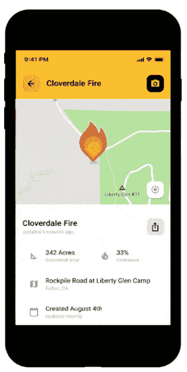

# 公民驱动的网络监测公共服务电台的自然灾害警报

> 原文：<https://hackaday.com/2022/12/17/citizen-driven-network-monitors-public-service-radio-for-natural-disaster-alerts/>

几乎在所有紧急情况下，时间都是至关重要的，尤其是在发生野火的时候。风力驱动的大火可以像货运列车一样咆哮着穿过富含燃料的土地，除了它可以在几秒钟内转向或跳过一英里宽的缺口。通常，对这样的火灾唯一现实的防御是尽快离开他们的道路，给专业人员腾出空间来尽他们所能灭火。

不幸的是，生活在受到野火和其他自然灾害威胁的地区的大多数人经常在信息真空中行动。官方渠道需要时间来发布疏散命令，当分秒必争时，这种延误可能会导致生命损失。这就是《守望相助》试图填补的漏洞。

 Watch Duty 是一个非营利性的野火警报、绘图和跟踪服务，为野火国家的居民提供近乎实时的信息。他们的情报是由经验丰富的消防记者网络产生的，这些记者生活在野火易发地区，监控公共服务无线电传输和其他来源，以了解他们特定地区正在发生的事情。当数据表明事故正在发生时，地图会更新，警报会通过智能手机应用发出。记者必须遵守严格的 T4 行为准则，该准则旨在确保公民的隐私和第一反应人员的安全。

虽然“守望先锋”的网络覆盖了加州的大部分地区(目前为止唯一覆盖的州)，但仍有大量的死区，主要位于内华达山脉的偏远地区和北部沿海地区。为了填补这些空白，Watch Duty 最近推出了由远程监听站网络组成的 [Watch Duty Echo](https://www.watchduty.org/blog/new-watch-duty-scanners) 。

每个站都挤满了 RTL-SDR 接收器，覆盖了当地消防、执法、EMS 机构使用的巨大频谱带——任何可能被呼叫来响应事件的组织。此外，每个站都有一个专用于监控 ADS-B 转发器和空中频带频率的 SDR，以获得需要空中支持的事件的预警。监听站配有宽带 discone 天线和专用的 1090 MHz ADS-B 天线，带有蜂窝调制解调器或 Starlink 终端，可连接到值班网络。

向值班的人们脱帽致敬，他们为这样一个系统付出了巨大的努力，并为公众利益而运作。那些选择亲近自然的人当然要自担风险，但一个利用科技的公民驱动的网络可以让这种风险变得稍微容易管理一点。