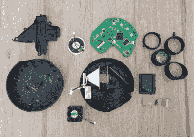

# 超级便宜的投影仪里面有什么？不是很多！

> 原文：<https://hackaday.com/2022/12/18/whats-inside-a-super-cheap-projector-not-a-lot/>

(Raymond Ma)喜欢浏览全球速卖通，购买价格低廉但承诺却很高的稀奇古怪的硬件。这是一个过程，他用他的开场白“我应该知道得更好，但是…”恰当地总结道，幸运的是，这些设备都被拆下来分析，所以我们每个人都可以享受和分享一点失望。

 一个这样的项目是 30 美元 [YT200 迷你投影仪](http://167.172.222.165/teardown-yt200-mini-projector-pixels-so-big-and-so-few/)，320×180 的像素几乎与成本一样低。然而，[Raymond]在内部寻找是否有比图像分辨率更大的黑客潜力。

YT200 缺乏任何类型的正常视频输入，而贫血的 15 流明输出被厚颜无耻地称为保护儿童眼睛免受过度亮度影响的功能。

来自单个 LED 的光被一些菲涅耳透镜准直。光线穿过一个液晶面板，图像从那里反射到一面镜子上，并通过一个装在螺旋导管中的聚焦透镜。焦距的调整是通过一个小杠杆来完成的，整个组件提供了足够的摩擦力来防止镜头自己移动到焦点之外。

该设备实际上工作得相当好:一种从连接的 USB 存储设备上播放一系列不同媒体类型的方法。不管怎样，只要一个人在黑暗的房间里。

[Raymond]希望为这个装置找到一些替代用途。我们是否可以建议[投射到磨砂玻璃球](https://hackaday.com/2015/08/12/cheap-projector-tells-time-invades-space/)中，创造出一种球形显示器？u 盘上的[幽灵般的眼睛动画](https://hackaday.com/2018/10/31/spooky-animated-eyes-for-your-frightening-needs/)可能会很好地与之搭配。