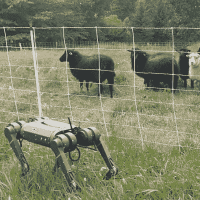

# 迷你猎豹克隆拆卸，不是别人，正是原设计师

> 原文：<https://hackaday.com/2022/12/19/mini-cheetah-clone-teardown-by-none-other-than-original-designer/>

[Ben Katz]设计了最初的麻省理工学院迷你猎豹机器人，它以其明显的非机器人运动和后空翻很容易吸引注意力和想象力。[本]的硕士论文在网上发表后不久，克隆的致动器开始出现在海外卖家手中，几个月后，整个机器人的克隆体也出现了。[Ben]最近有机会拆解 dogo tix 的一个克隆体，看看里面有什么。

Mini sheep, meet mini cheetah.

有趣的是，他注意到的第一件事是“脚”仍然只是现成的壁球，就像他最初的迷你猎豹设计一样。至于腿的其余部分，内部是一条穿过一些张紧器的带子，将膝关节连接到肩部的致动器。

正如人们所料，这些部件会受到相当大的压力，所以它们必须坚固。这种设计允许细长而强壮的腿，而无需在膝关节中放置致动器，你可能记得我们已经见过一个类似的机器人[通过增加一个刚性支架](https://hackaday.com/2022/11/19/simple-mod-lets-quadruped-robot-stand-and-walk/)获得了站立的能力。

在[Ben]拆卸和拍照的时候，阅读他的想法是很有趣的，你必须阅读他的文章才能了解所有的想法。但与此同时，为什么不花点时间看看邻居好奇的绵羊对下面嵌入的视频中的机器人有什么反应呢？由于电池电量不足，机器人笨拙地完成了一个后空翻，但不管怎样，绵羊似乎对此印象深刻。

 [https://www.youtube.com/embed/ga6HvMP-JtI?version=3&rel=1&showsearch=0&showinfo=1&iv_load_policy=1&fs=1&hl=en-US&autohide=2&wmode=transparent](https://www.youtube.com/embed/ga6HvMP-JtI?version=3&rel=1&showsearch=0&showinfo=1&iv_load_policy=1&fs=1&hl=en-US&autohide=2&wmode=transparent)

